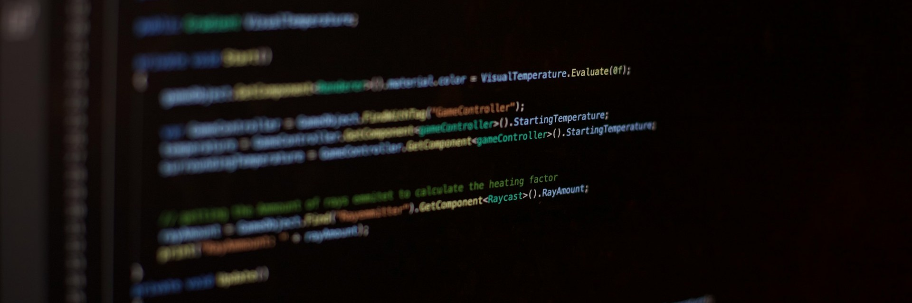

> Photo by [Bernd 📷 Dittrich](https://unsplash.com/@hdbernd?utm_source=unsplash&utm_medium=referral&utm_content=creditCopyText) on [Unsplash](https://unsplash.com/photos/a-computer-screen-with-a-bunch-of-text-on-it-zIukDkvw_vw?utm_source=unsplash&utm_medium=referral&utm_content=creditCopyText), edited by bricknpc

Hello world, and welcome to Eloquent Tables! We’re excited to introduce our very first open-source project, and we’re 
thrilled to have you here.

If you’ve ever found yourself rewriting the same boilerplate code again and again just to render a simple HTML table, 
you’re in the right place. And if you’ve ever tried to add more advanced features — sorting, searching, actions, 
form submissions — you’ve probably discovered that building tables often becomes more work than building the rest of 
your application.

<!--truncate-->

Eloquent Tables is a Laravel package designed to eliminate that headache. It lets you create clean, powerful, and fully 
functional HTML tables using nothing but Laravel. No HTML required. No CSS. No JavaScript. No fighting with form actions 
or wiring up sorting logic. Just write a few lines of PHP, and your table is ready to go.

Built _by_ backend developers _for_ backend developers, Eloquent Tables gives you the convenience of a fluent API, the 
flexibility of Eloquent, and the structure of Laravel — all while staying out of your way.

Version **1.0.0** is coming soon! We’re putting the final touches on documentation and squashing the last few bugs.

In the meantime, we’d love your support:

☆ Give the project a star on GitHub 
≻ Follow the repository to get notified when the first stable release drops

Thanks for joining us on this journey. We can’t wait to see what you build with Eloquent Tables!
