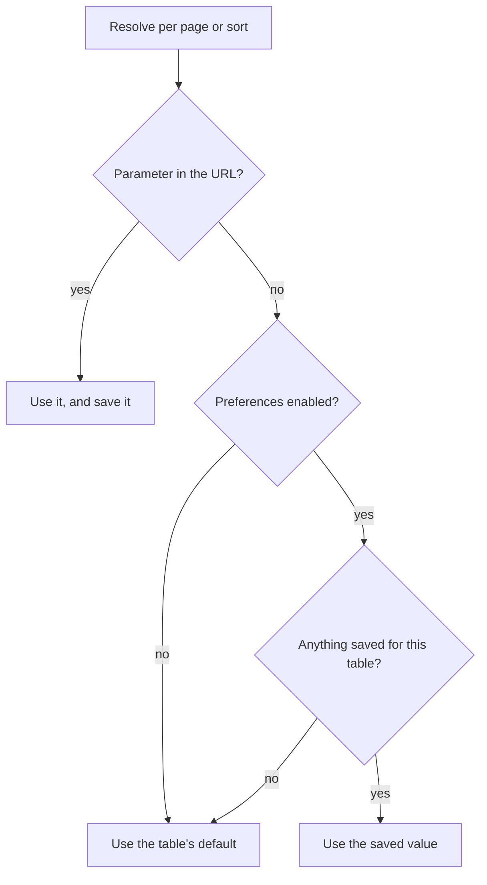

# Saved preferences

A visitor who sets a table to 50 rows per page and sorts it the way they like loses both the moment they navigate away.
Saved preferences fix that: the choice comes back on their next visit.

Two things are remembered, per table:

- the number of items per page
- the sort, including the order of a multi-column sort

Search terms and filter values are deliberately not remembered. Those are usually a one-off question rather than a
standing preference, and returning to a page with an old search still applied is more surprising than helpful.

## It is on by default

There is nothing to enable. Any table using [pagination](pagination.md) or [sorting](sorting.md) remembers the
visitor's choice already.

## Where it is stored

In a cookie on the visitor's own device. Nothing is written to your database and nothing is sent anywhere; the cookie
is read back by the table on the next request.

All of your tables share one cookie, keyed by [table name](table-names.md), so a page full of tables costs one cookie
rather than one each.

:::note
The cookie is written by the browser rather than by PHP, because the number of items per page has to be known before
the page renders. The package adds it to Laravel's `EncryptCookies` exception list for you, so it stays readable.
:::

## Turning it off

Because it stores data on the visitor's device, you may not want it. Switch it off in the config and no table will read
or write anything:

```php
// config/eloquent-tables.php
'preferences' => [
    'enabled' => false,
],
```

Tables keep working; they start from their defaults on every visit.

You can also rename the cookie:

```php
'preferences' => [
    'cookie_name' => 'my_app_table_preferences',
],
```

## What wins

A query parameter always beats a saved preference, and replaces it. Following a link with `?user[per_page]=10` shows ten
rows *and* makes ten the visitor's new saved choice.



:::warning
Because a query parameter is saved, a link shared between two people changes the recipient's saved preference too. This
is deliberate, because the URL is the source of truth, but it is worth knowing before you send someone a deep
link.
:::

## Clearing a sort

Cycling a column through ascending, descending and off removes it from the sort. Cycling the last one off clears the
sort entirely, and that is remembered as a choice: the table falls back to its declared default sort and does not
resurrect the old one on the next visit.

## Two tables, one preference

Tables are keyed by name, so two tables of the same class share a saved preference unless you give one of them its own
[name](table-names.md).
