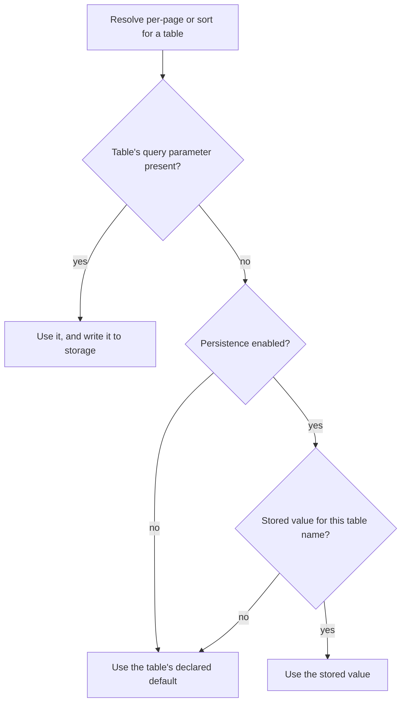
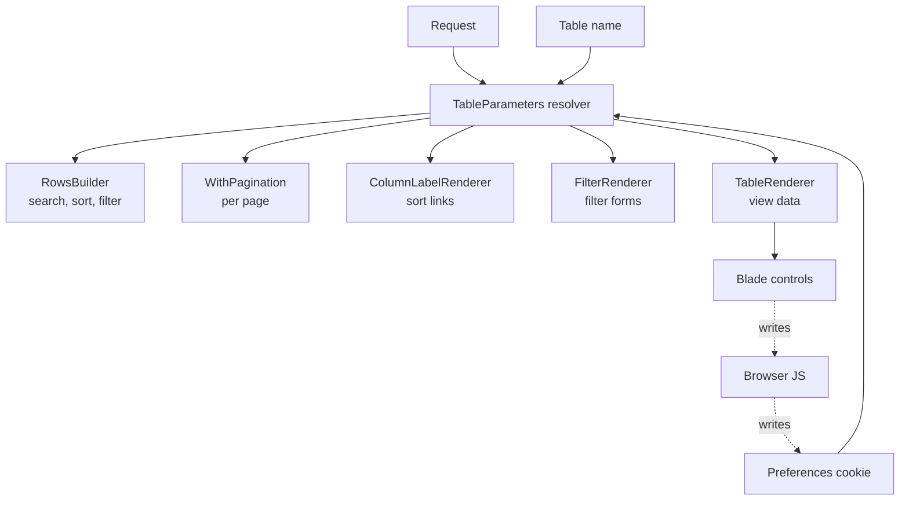

# Table Preferences - Plan

## Goal Capsule

- **Objective:** Give every table a stable name, namespace all of its query parameters under that name, and persist the viewer's per-page and multi-column sort choices across navigation. Resolves issue #5 for Release 2.0.
- **Authority hierarchy:** Product Contract Key Decisions (KD1–KD6) outrank planning decisions; Key Technical Decisions (KTD1–KTD8) outrank Implementation Unit approaches. `AGENTS.md` outranks this plan on repo process. Where an R and a KTD disagree, the R wins on product behavior and the KTD wins on mechanism.
- **Execution profile:** Work on `feature/user-preferences`, which targets `release/2.x`. One commit per implementation unit. No PHP on the host — every command runs through Docker.
- **Stop conditions:**
  - **Never run `git commit` or `git push`.** `AGENTS.md` makes this absolute and it overrides any skill instruction to the contrary. Leave the work in the tree and hand over a commit message per unit.
  - Stop and ask if a unit would change product behavior that KD1–KD6 settled.
  - Stop if the namespaced page name breaks Laravel's paginator in a way U5's tests cannot contain, rather than reverting KD3 unilaterally.
- **Tail ownership:** The author commits, pushes, and opens the PR. A run that ends at "ready to commit, gate green" is complete.
- **Product Contract preservation:** Changed — R18 split and extended, adding R22, R23 (search and filter controls carry the same state-loss fix) and R24 (per-table page-name properties removed). Both changes were surfaced and confirmed before plan-write; all other Product Contract content is unchanged.

---

## Product Contract

### Summary

Every table gains a stable name that namespaces both its query parameters and its stored preferences, so two tables on one page stop colliding on search, sort, filter, and pagination. Per-page and multi-column sort survive navigating away and back, stored on the viewer's device and switchable off by config. Sort precedence starts following the order columns were clicked, and the table's controls stop discarding the rest of the query string.

### Problem Frame

A viewer who sets a table to 50 rows per page and builds up a three-column sort loses both the moment they navigate away and come back. There is nowhere to keep that choice: `WithPagination::perPage()` resolves from the request, and the package writes nothing to the viewer's device today.

Underneath that sits a structural problem. A table has no identity. `TableRenderer` passes `spl_object_id($table)` as `id`, which is unique within one render and different on the next request, and is used only for DOM uniqueness. Nothing can be keyed to "this table" across requests.

The same absence produces a live collision. Search, sort, and filter read query parameters whose names come from package-wide config, not from the table, so two tables on one page already share `?search=`, `?sort[...]`, and `?filter[...]` — sorting one sorts both. Only `per_page` and `page` can be separated, and only because `WithPagination` exposes name properties for them. Persisting a per-table preference on top of parameters that are not per-table would encode the collision rather than resolve it.

Three adjacent defects compound the cost. Multi-column sort is precedence-lossy: the header links record click order faithfully in the URL, and the query builder then discards it and orders by column declaration order instead. Every control that submits state is a bare GET form with no hidden inputs, so changing the page size, the search term, or any single filter replaces the whole query string and drops everything else — including the other filters. And `RowsBuilder` reads a hardcoded `filter` key, so the configured filtering query name is honoured when filters render but ignored when they apply.

### Key Decisions

- KD1. **Persist per-page and multi-column sort; not search or filters.** (session-settled: user-directed — chosen over per-page alone and over a full preference store: multi-column sort is the driving case, while persisting search and filters is additive once the namespace exists.) Governs R12, R13.
- KD2. **The table's name is the single primitive, not a storage key sitting beside separate parameter-name overrides.** (session-settled: user-approved — chosen over adding a `sortName()` override mirroring the existing `perPageName()` pattern: independence holds by construction instead of requiring an author to keep two identifiers in sync.) Governs R1, R6.
- KD3. **The name namespaces every query parameter the table owns, including search and filter, not only the two being persisted.** (session-settled: user-directed — chosen over namespacing only the persisted parameters: it makes later search and filter persistence additive with no new public API, and keeps the breaking URL change to a single release.) Governs R6, R7, R8.
- KD4. **A query parameter both wins over the saved value and replaces it.** (session-settled: user-directed — chosen over saving only when the viewer operates a control: uniform and easier to explain, accepting that a shared or bookmarked link rewrites the recipient's saved preference.) Governs R14.
- KD5. **Click-order sort precedence is a defect fixed in this work.** (session-settled: user-directed — chosen over treating declaration order as intended and over a separate ticket: persisting a built-up sort carries no value if the built-up precedence is discarded when the query runs.) Governs R10.
- KD6. **Query-state loss in the table's controls is fixed here.** (session-settled: user-directed — chosen over its own ticket: persistence restores sort from storage but not search or filters, so shipping beside that hole would mask half the defect.) Governs R18, R22, R23.
- KD7. **Preferences are stored in a cookie, read in PHP and written in JavaScript.** Per-page resolves server-side before any script runs, so a client-only store would need a URL rewrite and a second round trip; writing the cookie from PHP would need `illuminate/cookie`, which is not a dependency, because the package returns a View and cannot attach a cookie to a response. Governs R12, R17.
- KD8. **Duplicate table names warn in the browser console rather than throwing.** Tables render independently, so a server-side collision check would require cross-table awareness the package does not have; the rendered page can see all of them. Follows the existing console warning for a missing Bootstrap runtime. Governs R5.

### Requirements

**Table identity**

- R1. Every table exposes a stable name that resolves to the same value on every request for that table.
- R2. The name defaults to a value derived from the table class, so an existing table gains identity without any author change.
- R3. A table author can override the name.
- R4. Two instances of the same table class on one page share a name, and therefore share query namespace and stored preferences, until the author gives at least one of them a distinct name.
- R5. When a rendered page contains two tables with the same name, the package emits a browser console warning naming the collision.

**Query parameter namespacing**

- R6. Every query parameter a table owns — search, sort, filter, per-page, and page — is nested under that table's name.
- R7. Two tables on one page search, sort, filter, and paginate independently of one another.
- R8. The configured query names for search, sorting, and filtering continue to apply as the parameter names within a table's namespace.
- R9. The filtering query name from config is honoured; `RowsBuilder::applyFilters` currently reads a hardcoded `filter` key and ignores it.
- R24. The per-table `pageName` and `perPageName` properties are removed. The page and per-page sub-key names come from config, matching how search, sorting, and filtering already resolve their names.

**Sort precedence**

- R10. Multi-column sort precedence follows the order in which the viewer clicked the column headers.
- R11. When the viewer cycles every sorted column back off, the table falls back to its declared default sort.

**Preference persistence**

- R12. A table's per-page value and its full multi-column sort, including precedence, persist on the viewer's device and apply when the viewer returns to the table with no relevant query parameter present.
- R13. Search terms and filter values do not persist.
- R14. A query parameter takes precedence over the stored value for that request and replaces the stored value.
- R15. Persistence is controlled by a package config option that is enabled by default.
- R16. When the config option is disabled, the package writes nothing to the viewer's device and reads no stored preference.
- R17. Stored preferences are scoped per table name, so one table's preferences never apply to another.

**Control state preservation**

- R18. Changing the per-page value preserves the table's active search, filters, and sort, and leaves every other table on the page untouched.
- R19. Changing the per-page value returns the table to its first page.
- R22. Submitting the search control preserves the table's active filters, sort, and per-page value, and leaves every other table on the page untouched.
- R23. Changing one filter preserves the table's active search, sort, per-page value, **and its other filters**, and leaves every other table on the page untouched.

**Migration and documentation**

- R20. `docs/docs/upgrading.md` documents the query parameter shape change, the sort precedence change, the removed page-name properties, and the new table name.
- R21. The documentation pages for pagination, sorting, searching, filters, and configuration reflect the namespaced parameter shape and the new config option.

### Query parameter shape

The namespacing change is what a 2.x consumer sees first. For a table named `users` alongside a second table named `orders`:

| Concern | Today | After |
|---|---|---|
| Search | `?search=ada` | `?users[search]=ada` |
| Sort | `?sort[email]=asc` | `?users[sort][email]=asc` |
| Filter | `?filter[active]=1` | `?users[filter][active]=1` |
| Per page | `?per_page=50` | `?users[per_page]=50` |
| Page | `?page=3` | `?users[page]=3` |
| Second table | collides with the first | `?orders[sort][total]=desc` |

### Key Flows

- F1. Returning to a table
  - **Trigger:** A viewer opens a page containing a table, with no query parameters for that table.
  - **Steps:** The table resolves its name; the request is checked for that table's parameters and finds none; the stored preference for that name is read and applied to per-page and sort; the table renders.
  - **Outcome:** The viewer sees the per-page value and multi-column sort they last chose.
  - **Covered by:** R1, R12, R17

- F2. Building up a multi-column sort
  - **Trigger:** A viewer clicks a second and then a third sortable column header.
  - **Steps:** Each click appends that column to the table's sort parameter in click order; the query orders by that same sequence; the resulting sort is written to storage.
  - **Outcome:** Rows are ordered by the viewer's chosen precedence, and that precedence is what returns on a later visit.
  - **Covered by:** R10, R12, R14

- F3. Opening a link that carries table parameters
  - **Trigger:** A viewer opens a bookmarked or shared URL containing that table's sort or per-page parameters.
  - **Steps:** The parameters win over the stored value for this request and replace it.
  - **Outcome:** The viewer sees the link's view, and it becomes their saved preference from then on.
  - **Covered by:** R14

- F4. Changing page size mid-investigation
  - **Trigger:** A viewer with an active search, an applied filter, and a two-column sort changes the per-page value.
  - **Steps:** The control submits the table's namespace with the new per-page value and the existing search, filter, and sort intact, resetting the page to the first; other tables' parameters are untouched.
  - **Outcome:** The same result set, same order, more rows visible.
  - **Covered by:** R18, R19

### Precedence resolution

### Acceptance Examples

- AE1. Stored sort applies on return
  - **Covers R12, R17.**
  - **Given** a viewer previously sorted the `users` table by name descending then email ascending,
  - **When** they open the page again with no `users` parameters in the URL,
  - **Then** rows are ordered by name descending then email ascending.

- AE2. A link overwrites the stored preference
  - **Covers R14.**
  - **Given** a viewer's stored `users` preference is 50 per page,
  - **When** they open a shared link containing `per_page=10` for that table,
  - **Then** the table shows 10 rows per page and their stored preference becomes 10.

- AE3. Two tables of the same class stay independent once named
  - **Covers R3, R4, R7, R17.**
  - **Given** a page renders two instances of the same table class and the author has given the second a distinct name,
  - **When** the viewer sorts the first table,
  - **Then** the second table's order and stored preferences are unaffected.

- AE4. An unnamed duplicate is reported, not silently merged
  - **Covers R4, R5.**
  - **Given** a page renders two instances of the same table class with no name override,
  - **When** the page loads,
  - **Then** both tables share one namespace and one stored preference, and a console warning names the collision.

- AE5. Clearing every sort returns to the default
  - **Covers R11.**
  - **Given** a viewer has cycled every sorted column back to unsorted,
  - **When** the table renders,
  - **Then** it uses its declared default sort, and no explicit empty sort is stored.

- AE6. Changing page size keeps the rest of the view
  - **Covers R18, R19.**
  - **Given** a viewer has an active search, an applied filter, and a two-column sort on page 3,
  - **When** they change the per-page value,
  - **Then** the search, filter, and sort all remain applied and the table shows the first page.

- AE7. Changing one filter keeps the others
  - **Covers R23.**
  - **Given** a viewer has two filters applied and an active search,
  - **When** they change the value of one filter,
  - **Then** the other filter and the search remain applied.

- AE8. Disabling persistence writes nothing
  - **Covers R16.**
  - **Given** the persistence config option is disabled,
  - **When** a viewer changes the per-page value and sorts a column,
  - **Then** the table behaves from query parameters alone and nothing is written to the viewer's device.

### Scope Boundaries

Deferred for later:

- Persisting search terms and filter values. The namespace makes this additive rather than a second public API negotiation.
- A per-table override of the persistence config option. The global option covers the stated requirement; a table-level opt-out is a natural later addition.
- An explicit sort-precedence hint on `Column`, letting an author pin precedence independently of click order.
- A deprecation window that reads the old flat parameter names alongside the namespaced ones.

Outside this work:

- Server-side or per-user preference storage. The issue frames this as device storage with a privacy config option, and a server-side store would require authentication and a migration.
- Keying stored preferences by URL path instead of by table name. Considered and rejected: tables on a page would have to be keyed positionally, so adding a table would shift existing viewers' preferences, and it does nothing about the query parameter collision.

#### Deferred to Follow-Up Work

- Adding a second theme's copies of the rewritten control views. Bootstrap 5 is the only theme in the tree, so there is nothing else to update; a new theme inherits the new shape.

### Sources / Research

Verified against the branch tip on 2026-08-16:

- `src/Concerns/WithPagination.php` — `perPage()` resolves from the request server-side; `pageName()` and `perPageName()` are the only per-table parameter names today.
- `src/Builders/RowsBuilder.php:105` — `applySort()` iterates the column list, so precedence follows column declaration order and the URL's array order is discarded.
- `src/Builders/RowsBuilder.php:84` — `applyFilters()` reads a hardcoded `filter` key, while `src/Filters/FilterRenderer.php:26` reads `Config::filterQueryName()`. Filters therefore render under a custom name but never apply under it.
- `src/Columns/ColumnLabelRenderer.php:87` — `getSortArray()` unsets then re-appends the clicked column, so the URL does record click order.
- `src/Services/Config.php:35` — search, sort, and filter query names are package-wide, with no per-table override.
- `src/Tables/TableRenderer.php:120` — `spl_object_id($table)` is the only table identifier and is per-render.
- `resources/views/bootstrap-5/header.blade.php:18,43` and `resources/views/bootstrap-5/filter/filter.blade.php:1` — the search, per-page, and filter controls are all bare GET forms, so each submit replaces the entire query string.
- `resources/views/bootstrap-5/table.blade.php:6` — `data-{namespace}-table` carries the render id and is the hook the bundled JavaScript uses to find tables.
- `resources/views/js.blade.php:247` — the existing console-warning precedent for a missing Bootstrap runtime.
- `composer.json` — `illuminate/cookie` is not a dependency.
- `docs/docs/upgrading.md:7` — the guide currently promises that users of columns, formatting, searching, sorting, filters, or pagination have nothing to do. This work makes that false.

---

## Planning Contract

### Key Technical Decisions

- KTD1. **Nest the table's parameters under its name (`?users[sort][email]=asc`) rather than prefixing them (`?users_sort[email]=asc`).** Nesting has no prefix-ambiguity between a table named `users_per` and a table named `users`, and it matches KD3's model of one namespace owning everything. A Docker probe confirmed that a bracketed page name (`users[page]`) merges correctly with a nested query array through Laravel's `Arr::query` and round-trips through `parse_str`, which was the main risk. Governs R6.
- KTD2. **Remove the per-table `pageName` and `perPageName` properties; move both sub-key names to config.** (session-settled: user-approved — chosen over retaining them as per-table sub-key overrides: the table name already supplies the per-table distinction those properties existed for, and `AGENTS.md` places query parameter names in config rather than on the table.) Governs R24.
- KTD3. **Fix query-state loss in all three controls, not per-page alone.** (session-settled: user-approved — chosen over holding the fix to the per-page control: namespacing rewrites all three forms regardless, and a filter control that drops sibling filters is the worst instance of the defect.) Governs R18, R22, R23.
- KTD4. **Store every table's preferences in one JSON cookie rather than one cookie per table.** A single cookie bounds the cookie count at one, keeps the name predictable for clearing and for the disable path, and avoids growing per-request header weight with table count. The write path evicts least-recently-updated entries when the serialised value would exceed a safe size, because silent browser truncation would corrupt every table's preferences at once. Governs R12, R17.
- KTD5. **Derive the default name from the class basename, snake-cased, with a trailing `Table` removed** — `App\Tables\UserTable` becomes `user`. The name is URL-facing now, so readability outranks collision-proofing; cross-namespace collisions are exactly what R5's warning surfaces and R3's override resolves. Fall back to the un-stripped basename when stripping would leave an empty string. Governs R2.
- KTD6. **Publish the table name to JavaScript as a new data attribute rather than changing the value of the existing `data-{namespace}-table`.** That attribute's value is the browser-facing contract `AGENTS.md` names as public API, and the JS already selects on the attribute's presence. Adding a sibling attribute is additive. Governs R5, R12.
- KTD7. **A dedicated service owns namespaced parameter names and reads.** Every read path — row building, column labels, filter rendering, pagination, view data — needs the same "what is this table's key for X, and what is its current value" answer. Centralising it keeps the namespacing rule in one place rather than restated at six call sites. It is a service, not a renderer, because it returns data; this follows the naming rule in `AGENTS.md`. Governs R6, R8.
- KTD8. **Fix sort precedence by iterating the sort request rather than the column list.** `applySort` currently drives from `$this->columns`, which is where declaration order enters. Driving from the request array and looking each column up preserves click order, and the column list still gates which keys are sortable. Governs R10.

### High-Level Technical Design

The new resolver sits between the request and every existing read path. Nothing else learns about namespacing.

The resolver answers two things for a given table and concern: the fully-qualified parameter key (`users[sort]`) and the effective value after precedence (query parameter, then stored preference, then declared default). The cookie is read-only on the PHP side; the browser owns every write.

### Assumptions

- The serialised preferences cookie stays well under the 4KB per-cookie limit at realistic table counts. KTD4's eviction covers the tail rather than relying on this.
- `Arr::query` behaviour with a bracketed page name is stable across the Laravel 12 line. The probe verified the current pinned version; U5 pins it with a test rather than trusting it.
- No consumer depends on `data-{namespace}-table` carrying `spl_object_id` specifically, only on the attribute being present. KTD6 avoids needing this to be true.

### Sequencing

U1 and U2 are independent and come first. U3 depends on both. U4, U5, and U7 all depend on U3. U6 and U8 are independent of the namespacing chain and can land any time. U9 depends on U3; U10 depends on U7 and U9. U11 lands last so the documentation describes the finished shape.

### System-Wide Impact

- **Browser-facing contract.** New data attribute (KTD6) and rewritten control markup. `AGENTS.md` classifies both element ids and data attributes as public API.
- **Published views.** Users publish `resources/views`; the three rewritten controls change shape, and a published copy will silently keep the old behaviour. This needs an upgrade-guide entry telling users to republish.
- **URL contract.** Every 1.x URL for every table breaks. The upgrade guide's opening currently tells non-actions users they have nothing to do; U11 rewrites that framing.
- **Translations.** Any new user-facing string needs a matching `resources/lang/nl.json` entry in the same change, or `TranslationsTest` fails.

### Risks & Dependencies

- **Coverage metadata is the likeliest gate failure.** New classes pulled into existing tests must be declared with `#[UsesClass]` or the suite goes risky and coverage drops. `AGENTS.md` names this as the most common trip-up in this repo.
- **`composer cs` rewrites code**, including sorting imports by length. Run it before the final test pass, not after.
- **Substring assertions false-positive** against the always-emitted CSS and JS partials. Assert on precise markers.
- **No new dependency is required.** Reading a cookie uses `illuminate/http`, which is already required. If any unit reaches for `Cookie::queue()`, that is a signal the design drifted from KD7.

---

## Implementation Units

| U-ID | Title | Files touched | Depends on |
|---|---|---|---|
| U1 | Table identity | `src/Table.php` | — |
| U2 | Config surface | `config/eloquent-tables.php`, `src/Services/Config.php` | — |
| U3 | Table parameter resolver | `src/Services/TableParameters.php` | U1, U2 |
| U4 | Route read paths through the resolver | `src/Builders/RowsBuilder.php`, `src/Columns/ColumnLabelRenderer.php`, `src/Filters/FilterRenderer.php`, `src/Tables/TableRenderer.php` | U3 |
| U5 | Paginator integration, remove name properties | `src/Concerns/WithPagination.php`, `src/Builders/RowsBuilder.php` | U3 |
| U6 | Click-order sort precedence | `src/Builders/RowsBuilder.php` | — |
| U7 | Query-state preservation in the controls | `resources/views/bootstrap-5/header.blade.php`, `resources/views/bootstrap-5/filter/filter.blade.php` | U3, U4 |
| U8 | Duplicate table name warning | `resources/views/js.blade.php`, `resources/views/bootstrap-5/table.blade.php` | U1 |
| U9 | Read stored preferences | `src/Services/TablePreferences.php`, `src/Services/TableParameters.php` | U3 |
| U10 | Write stored preferences | `resources/views/js.blade.php` | U7, U9 |
| U11 | Documentation and upgrade guide | `docs/docs/**` | U1–U10 |

### U1. Table identity

- **Goal:** `Table` exposes a stable, overridable name.
- **Requirements:** R1, R2, R3, R4
- **Dependencies:** none
- **Files:** `src/Table.php`, `tests/Unit/TableTest.php`
- **Approach:**
  1. Add a public `name(): string` to `Table`, alongside the other overridable hooks (`tableStyles()`, `pageStyle()`).
  2. Default it per KTD5 — class basename, snake-cased, trailing `Table` stripped, falling back to the un-stripped basename when stripping empties the string.
  3. Do not touch `spl_object_id`; DOM uniqueness keeps using it.
- **Patterns to follow:** the existing overridable hooks on `Table`; `Illuminate\Support\Str` helpers are already available through `illuminate/support`.
- **Test scenarios:**
  - A table class named `UserTable` defaults to `user`.
  - A table class named `ArchivedUserTable` defaults to `archived_user`.
  - A table class named `Table` falls back to `table` rather than an empty string.
  - An anonymous table class produces a non-empty name.
  - An override returns the overridden value rather than the derived one.
- **Verification:** `TableTest` covers every branch of the derivation, including the fallback.

### U2. Config surface

- **Goal:** Config carries the page and per-page sub-key names and the persistence option.
- **Requirements:** R8, R15, R24
- **Dependencies:** none
- **Files:** `config/eloquent-tables.php`, `src/Services/Config.php`, `tests/Unit/Services/ConfigTest.php`
- **Approach:**
  1. Add a `pagination` block with `page_query_name` (`page`) and `per_page_query_name` (`per_page`), matching the shape of the existing `search`, `sorting`, and `filtering` blocks.
  2. Add a `preferences` block with an enabled flag defaulting to `true` and a cookie name.
  3. Add matching accessors to `Services\Config`, following the existing `searchQueryName()` shape including the defaulted `get()` call and the PHPStan var annotation.
- **Patterns to follow:** `src/Services/Config.php:35-57` for accessor shape; the comment style in `config/eloquent-tables.php` documents each block.
- **Test scenarios:**
  - Each new accessor returns the configured value.
  - Each new accessor returns its documented default when the key is absent.
  - The persistence flag returns `true` when unset.
- **Verification:** `ConfigTest` covers every new accessor in both the configured and defaulted branch.

### U3. Table parameter resolver

- **Goal:** One service answers "what is this table's key for concern X" and "what is its current value".
- **Requirements:** R6, R8, R17
- **Dependencies:** U1, U2
- **Files:** `src/Services/TableParameters.php`, `tests/Unit/Services/TableParametersTest.php`
- **Approach:**
  1. Introduce a service taking `Config`, exposing a key builder that returns the nested name for a table and concern, and a value reader that pulls the table's parameter out of a request.
  2. Keep it a `Service`, not a `Renderer` — it returns data (per the naming rule in `AGENTS.md`).
  3. Cover all five concerns: search, sort, filter, per-page, page.
  4. Leave preference fallback out of this unit; U9 layers it on.
- **Patterns to follow:** `src/Services/Config.php` for a readonly service with constructor injection; the generic templating on `Table<TModel>` where the signature takes a table.
- **Test scenarios:**
  - The key for a table named `users` and the sort concern is the nested sort key under `users`.
  - Custom configured query names appear as the sub-key, not the hardcoded default.
  - Reading a concern from a request with no parameters for that table returns the empty/absent case.
  - Reading a concern returns only that table's value when the request carries two tables' parameters.
  - A non-array value where an array is expected is coerced to empty rather than throwing.
- **Verification:** `TableParametersTest` covers every concern in both the present and absent branch.

### U4. Route read paths through the resolver

- **Goal:** Every existing read of a table query parameter goes through the resolver.
- **Requirements:** R6, R7, R8, R9
- **Dependencies:** U3
- **Files:** `src/Builders/RowsBuilder.php`, `src/Columns/ColumnLabelRenderer.php`, `src/Filters/FilterRenderer.php`, `src/Tables/TableRenderer.php`, and the matching tests under `tests/Unit/`
- **Approach:**
  1. Inject the resolver into each of the four consumers.
  2. Replace the direct `$request->query(...)` reads in `applySearch`, `applySort`, and `applyFilters` with resolver reads. This is where R9's hardcoded `filter` key disappears.
  3. `ColumnLabelRenderer::getSortArray` and its `fullUrlWithQuery` call build the nested sort key, so sort links keep preserving unrelated parameters.
  4. `FilterRenderer` passes the nested filter key to the view as the field name.
  5. `TableRenderer` passes the table name and the resolved keys into the view data.
  6. `ColumnLabelRenderer::build` and `FilterRenderer::build` need the table to resolve a name — thread it through rather than reaching for a global.
- **Execution note:** `RowsBuilder` and `ColumnLabelRenderer` have existing suites asserting on the flat parameter names. Update those assertions first and watch them fail before wiring the resolver in, so the new shape is proven rather than assumed.
- **Patterns to follow:** existing constructor injection on these four classes; `$request->fullUrlWithQuery` as already used at `src/Columns/ColumnLabelRenderer.php:42`.
- **Test scenarios:**
  - Searching reads the table's nested search parameter and ignores a flat `search`.
  - Sorting reads the table's nested sort parameter.
  - Filtering reads the table's nested filter parameter, under a **custom configured** filtering query name (this is R9's regression).
  - Two tables with different names on one request sort independently.
  - A sort link href preserves the table's search and filter parameters, and any other table's parameters.
  - A filter select renders with the nested field name.
- **Verification:** the four existing suites pass against namespaced parameters, and the R9 regression has a test that fails on the current hardcoded key.

### U5. Paginator integration and removal of the name properties

- **Goal:** Pagination works under the namespace, and the per-table name properties are gone.
- **Requirements:** R6, R19, R24
- **Dependencies:** U3
- **Files:** `src/Concerns/WithPagination.php`, `src/Builders/RowsBuilder.php`, `tests/Unit/Builders/RowsBuilderTest.php`
- **Approach:**
  1. Remove the `pageName` and `perPageName` properties and their accessors; source both sub-key names from config instead.
  2. `perPage()` resolves through the resolver rather than reading the request directly.
  3. `RowsBuilder::build` passes the nested page key as the paginator's `pageName`.
  4. Keep `withQueryString()`; the probe confirmed it merges correctly with a bracketed page name.
  5. Changing per-page must reset to the first page (R19) — that is the control's job in U7, but assert the paginator honours an absent page key here.
- **Patterns to follow:** `src/Builders/RowsBuilder.php:67-69` for the existing paginate call.
- **Test scenarios:**
  - A paginator link URL carries the nested page key and round-trips to the right page.
  - A paginator link URL preserves the table's sort and search parameters.
  - A paginator link URL preserves a second table's parameters.
  - Requesting page 2 of one table leaves the other table on page 1.
  - `perPage()` returns the configured default when no parameter is present.
  - A zero or negative per-page value falls back to the default, as today.
- **Verification:** the nested page name is proven by an assertion on a generated paginator URL, not by inspection.

### U6. Click-order sort precedence

- **Goal:** Multi-column sort orders by click order, not column declaration order.
- **Requirements:** R10, R11
- **Dependencies:** none
- **Files:** `src/Builders/RowsBuilder.php`, `tests/Unit/Builders/RowsBuilderTest.php`
- **Approach:**
  1. Per KTD8, drive `applySort` from the sort request array instead of the column collection.
  2. Look each requested key up against the sortable columns; ignore keys that are absent or not sortable.
  3. Keep the existing `sortUsing` closure path and the `defaultSort` fallback, including the current rule that defaults apply only when the sort request is empty (R11).
- **Execution note:** Write the failing precedence test first. The current implementation passes a single-column sort test either way, so only a multi-column assertion with a deliberately reversed declaration order proves the fix.
- **Patterns to follow:** the existing closure dispatch at `src/Builders/RowsBuilder.php:121-123`.
- **Test scenarios:**
  - Two columns clicked in reverse declaration order produce ORDER BY in click order.
  - Three columns preserve full click order.
  - Re-clicking an already-sorted column moves it last in precedence, matching what the header links already encode.
  - A sort key naming a non-sortable column is ignored.
  - A sort key naming an unknown column is ignored rather than throwing.
  - An empty sort request falls back to the declared default sort.
  - A column with a `sortUsing` closure still receives the closure path, in click-order position.
- **Verification:** assert on generated SQL or binding order, not on row output alone, so precedence is unambiguous.

### U7. Query-state preservation in the controls

- **Goal:** The search, per-page, and filter controls stop discarding the rest of the query string.
- **Requirements:** R18, R19, R22, R23
- **Dependencies:** U3, U4
- **Files:** `resources/views/bootstrap-5/header.blade.php`, `resources/views/bootstrap-5/filter/filter.blade.php`, `tests/Unit/Tables/TableRendererTest.php`, `tests/Unit/Filters/FilterRendererTest.php`
- **Approach:**
  1. Each GET form carries the rest of the current query as hidden inputs, so a submit no longer replaces the query string. The sort links already solve this with `fullUrlWithQuery`; the forms are the only controls that do not.
  2. Scope what each form re-emits: everything except the key that form owns, including other tables' parameters and this table's other concerns.
  3. The filter form re-emits sibling filters — the worst instance of the current defect.
  4. The per-page form omits the table's page key, which is how R19 resets to the first page.
  5. Nested keys need bracket-notation input names; hidden inputs must flatten the nested array correctly.
- **Patterns to follow:** the existing form markup in these files; keep the `onchange="this.form.submit()"` behaviour and the element id scheme unchanged.
- **Test scenarios:**
  - Covers AE6. Rendering with an active search, filter, and sort emits hidden inputs for all three inside the per-page form.
  - Covers AE6. The per-page form does not emit the table's page key.
  - Covers AE7. With two filters applied, each filter form re-emits the sibling filter.
  - The search form re-emits the table's filter, sort, and per-page values.
  - Every form re-emits a second table's parameters untouched.
  - A table with no active search, sort, or filters emits no stray empty hidden inputs.
- **Verification:** assert on precise input markers (name and value together), not bare substrings — the always-emitted CSS and JS partials make loose assertions false-positive.

### U8. Duplicate table name warning

- **Goal:** Two tables sharing a name are reported in the browser console.
- **Requirements:** R5
- **Dependencies:** U1
- **Files:** `resources/views/bootstrap-5/table.blade.php`, `resources/views/js.blade.php`, `tests/Unit/Tables/TableRendererTest.php`
- **Approach:**
  1. Per KTD6, emit the table name as a new `data-{namespace}-table-name` attribute on the table section, leaving `data-{namespace}-table` untouched.
  2. In the DOM-ready block that already iterates tables, collect the names and `console.warn` on any duplicate, naming the repeated value.
  3. Warn once per duplicated name, not once per table.
- **Patterns to follow:** `resources/views/js.blade.php:243-253` for the DOM-ready iteration and `:247` for the existing warning's tone.
- **Test scenarios:**
  - The rendered table section carries the name attribute with the table's name.
  - The existing `data-{namespace}-table` attribute still carries the render id.
  - The emitted script contains the duplicate-detection branch.
- **Verification:** PHP-side tests assert the emitted markup and script content; the console behaviour itself is not unit-testable here and is verified by inspection.

### U9. Read stored preferences

- **Goal:** Per-page and sort fall back to the stored preference when no query parameter is present.
- **Requirements:** R12, R14, R15, R16, R17
- **Dependencies:** U3
- **Files:** `src/Services/TablePreferences.php`, `src/Services/TableParameters.php`, `tests/Unit/Services/TablePreferencesTest.php`
- **Approach:**
  1. Introduce a read-only preferences service that decodes the cookie, per KD7 and KTD4, and exposes a table's stored per-page and sort.
  2. Wire it into the resolver's value reader so precedence is query parameter, then stored preference, then declared default — matching the Precedence resolution diagram.
  3. Return the absent case when the config flag is off, without reading the cookie at all (R16).
  4. Treat a malformed or non-decodable cookie as absent rather than throwing; a corrupted cookie must not break rendering.
  5. Preserve stored sort order — it carries precedence, so the decoded structure must be order-significant.
- **Patterns to follow:** `readonly class` with constructor injection, as `Config` and `FilterRenderer` do; `$request->cookie()` from `illuminate/http`.
- **Test scenarios:**
  - Covers AE1. A stored multi-column sort applies, in stored precedence order, when the request carries no sort for that table.
  - Covers AE2. A query parameter wins over the stored value.
  - Covers AE8. With persistence disabled, a present cookie is ignored entirely.
  - A stored preference for `users` does not apply to `orders`.
  - A malformed cookie value yields the declared defaults rather than an exception.
  - A cookie holding no entry for this table yields the declared defaults.
  - Covers AE5. An empty stored sort yields the declared default sort rather than an explicitly empty sort.
- **Verification:** precedence is proven by a test carrying both a cookie and a conflicting query parameter.

### U10. Write stored preferences

- **Goal:** The browser writes the table's per-page and sort to the cookie.
- **Requirements:** R12, R14, R15, R16
- **Dependencies:** U7, U9
- **Files:** `resources/views/js.blade.php`, `tests/Unit/Tables/TableRendererTest.php`
- **Approach:**
  1. On DOM ready, per table, read that table's per-page and sort from the current URL and write them into the shared cookie under the table's name. This is what makes KD4's "any query parameter saves" rule hold, including for a link the viewer merely opened.
  2. Read-modify-write the single JSON cookie so one table's write does not drop another's entry.
  3. Apply KTD4's eviction: when the serialised value would exceed the safe size, drop least-recently-updated entries before writing.
  4. Emit the enabled flag and cookie name into the script from config; when disabled, write nothing and read nothing.
  5. Set a long expiry and a `SameSite` value appropriate for a first-party preference cookie.
- **Patterns to follow:** the per-table class instantiation in the DOM-ready block; the `data-{namespace}-*` attribute convention for passing PHP values to the script.
- **Test scenarios:**
  - The emitted script carries the configured cookie name.
  - With persistence disabled, the emitted script contains no write path.
  - The emitted script carries the enabled flag matching config.
  - Covers AE8. Rendering with persistence disabled emits no preference-writing code.
- **Verification:** PHP-side assertions on the emitted script; browser behaviour is verified by inspection against the acceptance examples.

### U11. Documentation and upgrade guide

- **Goal:** The docs describe the shipped shape, and the upgrade guide tells every 1.x user what changed.
- **Requirements:** R20, R21
- **Dependencies:** U1–U10
- **Files:** `docs/docs/upgrading.md`, `docs/docs/pagination.md`, `docs/docs/sorting.md`, `docs/docs/searching.md`, `docs/docs/filters.md`, `docs/docs/configuration.md`, and a new page for table naming and preferences
- **Approach:**
  1. Rewrite the upgrade guide's opening. It currently promises that users of columns, formatting, searching, sorting, filters, or pagination have nothing to do; that is now false for everyone, and the framing change matters more than a new numbered section.
  2. Add numbered upgrade sections for the namespaced query parameters, the removed `pageName`/`perPageName` properties, the click-order sort precedence change, and republishing views.
  3. Note the new table name and the persistence config option under `## New in 2.0`.
  4. Update `pagination.md` to drop the two removed properties and point at the config keys.
  5. Update `sorting.md` for click-order precedence, and `searching.md` / `filters.md` / `configuration.md` for the namespaced shape.
  6. Add any new user-facing string to `resources/lang/nl.json` in this change, or `TranslationsTest` fails.
- **Patterns to follow:** the existing numbered-section shape in `docs/docs/upgrading.md`; `:::warning` admonitions for anything that silently does the wrong thing, per the docs conventions in `AGENTS.md`.
- **Test scenarios:** `Test expectation: none -- documentation only. Link validity is covered by the docs build in the Verification Contract.`
- **Verification:** the Docusaurus build passes with `onBrokenLinks: throw`.

---

## Verification Contract

There is no PHP on the host. Every command runs through Docker.

| Gate | Command | Requirement |
|---|---|---|
| Tests | `docker compose run --rm -T php composer test` | Green, with no risky and no warning tests |
| Coverage | `docker compose run --rm -T php php vendor/bin/phpunit -c phpunit.xml --coverage-text` | 100% lines, methods, and classes; no drop versus the previous run |
| Static analysis | `docker compose run --rm -T php composer ps` | PHPStan clean at `level: max` over `src` |
| Code style | `docker compose run --rm -T php composer cs` | Run until it reports `Fixed 0 of N files` |
| Docs build | `docker compose run --rm -T -w /app docs npx docusaurus build` | Passes; then `docker compose run --rm -T -w /app docs rm -rf build` |

Notes that decide whether the gate passes on the first try:

- Every new class needs `#[CoversClass]` on its test, and every other production class a test executes needs `#[UsesClass]`. Adding assertions on rendered markup routinely drags in new classes and turns a passing test risky.
- If coverage drops unexpectedly, check the risky list first — an undeclared class is the usual root cause, and a risky test's coverage is not credited.
- `composer cs` rewrites files, including sorting imports by length. Run it before the final test pass and re-run the tests after.
- The docs `build/` directory is created root-owned; remove it through the same Docker service.

## Definition of Done

Global:

- All eleven units are complete, each as its own commit-ready change in the working tree.
- All five gates in the Verification Contract pass.
- Every requirement R1–R24 is satisfied or explicitly deferred in Scope Boundaries.
- Every acceptance example AE1–AE8 has a corresponding passing test, except where the unit notes browser-only verification.
- `docs/docs/upgrading.md` covers every item on the breaking-change list in `AGENTS.md` that this work touches: the removed properties, the query parameter shape, the changed sort behaviour, the new data attribute, and republishing views.
- Abandoned or experimental code from approaches that did not pan out is removed from the diff. Throwaway probe tests are deleted, not left behind marked `#[CoversNothing]`.
- **No commit and no push has been made.** The work sits in the tree with a commit message handed over per unit.

Per unit: the unit's test scenarios pass, its cited requirements hold, and the full gate is green before moving to the next unit.
