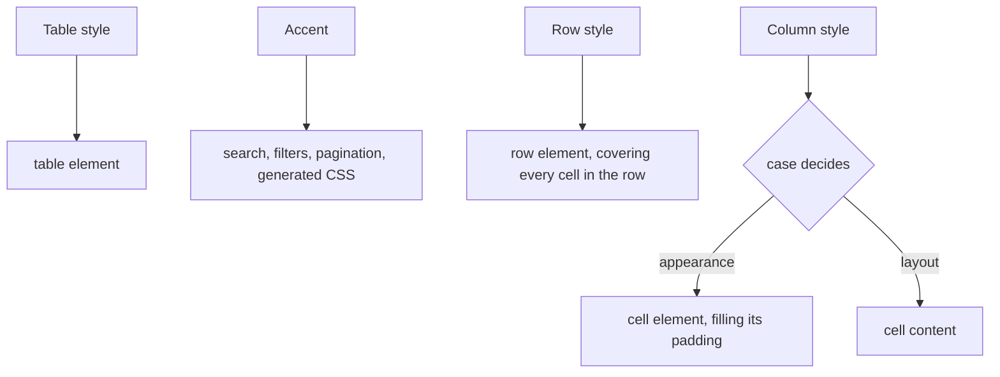
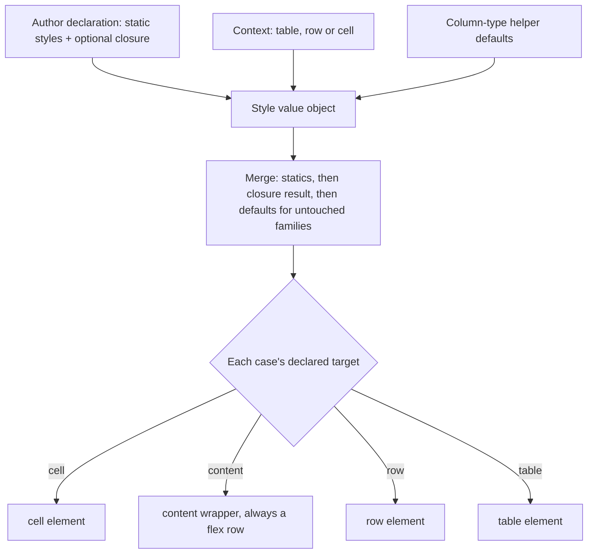

# Table Styling - Plan

## Goal Capsule

- **Objective:** Give every styling surface on a table the same shape — static styles plus an optional context-aware closure — and make a declared alignment behave identically everywhere. Closes issue #7 and covers table, row, column, cell and accent styling for Release 2.0.
- **Authority hierarchy:** Product Contract Key Decisions (KD1-KD10) outrank Key Technical Decisions (KTD1-KTD8), which outrank unit approaches. `AGENTS.md` outranks this plan on repo process. Where an R and a KTD disagree, the R wins on product behaviour and the KTD wins on mechanism.
- **Execution profile:** A `feature/*` branch off `release/2.x`, which does not exist yet. One commit per implementation unit. No PHP on the host — every command runs through Docker.
- **Stop conditions:**
  - **Never run `git commit` or `git push`.** `AGENTS.md` makes this absolute and it overrides any skill instruction. Leave the work in the tree and hand over a commit message per unit.
  - Stop the `docs` compose service before any Docusaurus build; the dev server and the build contend over `.docusaurus`.
  - Stop and ask if a unit would change behaviour that KD1-KD10 settled.
- **Tail ownership:** The author commits, pushes and opens the PR. A run ending at "ready to commit, gate green" is complete.
- **Product Contract preservation:** Unchanged. No requirement was split, reworded or re-scoped during planning.
- **Open blockers:** None. Every product-level decision is settled, and the five forks the brainstorm deferred are resolved in the Planning Contract below.

---

## Product Contract

### Summary

Every styling surface on a table takes the same shape: static styles plus an optional closure that decides from context. Table, row, column, cell and the table's accent each keep their own vocabulary, so a case can only be used where it means something. A declared alignment starts rendering identically across column types, in headers and body alike.

### Problem Frame

A column's styling API contradicts its own documentation. `docs/docs/columns.md` promises that a cell style "will result in the text of both the `th` as well as the `td` element being right aligned". Rendering the views shows that holds for one case out of several.

Issue #7 caught one symptom: a sortable column right-aligns, the same column without `sortable()` does not. The cause is that every alignment case carries two variants — `justify-content-end` for a flex container, `text-end` outside one. The sortable header puts the flex variant on a full-width anchor and works. The non-sortable header puts the non-flex variant on a plain `div` inside a flex row, where the div shrinks to its content and the class has nothing to align within.

The same promise fails again by column type. `td-text` honours the declared style; `td-boolean` and `td-checkbox` hardcode centring and ignore it entirely. The bulk-action and row-action cells hardcode their alignment too. So a declared alignment reaches one of three column types, in the body only.

Underneath the bug sits an API that grew two overlapping halves. A column takes both `styles()` (table vocabulary, lands on the cell) and `cellStyles()` (cell vocabulary, lands on the content), and both can colour a cell — differently, because only the first fills the cell's padding. An author has to know which of two methods to reach for, and the answer is not guessable.

Nothing at any level can vary by value. A column that should show negative amounts in red has no way to say so, and there is no row-level styling at all.

### Key Decisions

- KD1. **One `style()` on a column, replacing `styles()` and `cellStyles()`.** (session-settled: user-directed — chosen over keeping both with a sharper boundary, and over splitting them by axis: an author should not have to learn which of two methods colours a cell.) Governs R5.
- KD2. **Each style case declares its own target element.** (session-settled: user-directed — chosen over placing everything on the cell and over placing everything on the content: a background should fill the cell, while alignment belongs on the content.) Governs R6.
- KD3. **The conditional closure fires everywhere, and the context names what is being rendered.** (session-settled: user-directed — chosen over firing for body cells only and over an explicit scope argument: a header carries no model, so the common guard falls out naturally.) Governs R9, R10.
- KD4. **The vocabulary covers background colour, text colour and font weight.** (session-settled: user-directed — chosen over backgrounds and weight alone, and over only the four colours first named: a negative amount usually wants red text rather than a red cell.) Governs R7, R8.
- KD5. **Styles always merge; the package does not resolve conflicts.** (session-settled: user-directed — chosen over the package resolving same-family collisions: a column declared green and conditionally red is the author's to fix.) Governs R4.
- KD6. **Hard break in 2.0, with no deprecation aliases.** (session-settled: user-directed — chosen over carrying aliases through 2.x, matching how the release handled the removed pagination properties.) Governs R23.
- KD7. **`boolean()` and `checkbox()` apply overridable default styles.** (session-settled: user-directed — chosen over deleting the hardcoded centring outright: the type decides what is rendered, and the centring is a default the helper contributes.) Governs R20, R21.
- KD8. **Scope covers table, row, column, cell and accent. Actions are deferred pending this release.** (session-settled: user-directed — chosen over including actions now and over the smaller table/column/cell set: whether the action capability should fold in is a question this release's outcome will answer.) Governs R1. **Closed:** the outcome answered it yes, and actions were folded in by [the action styling parity plan](2026-08-17-0045-feat-action-styling-parity-plan.md).
- KD9. **Uniform shape, level-specific vocabularies.** (session-settled: user-directed — chosen over one vocabulary resolved by level and over one vocabulary with explicitly scoped cases: the type should make `AlignRight` on a table impossible rather than merely meaningless.) Governs R3.
- KD10. **Row styling is in scope.** (session-settled: user-directed — chosen over approximating it per column: the per-column workaround cannot reach the bulk-action and row-action cells, so a highlighted row renders with two uncoloured ends.) Governs R11, R12.

### Requirements

**Uniform styling shape**

- R1. Table, row, column, cell and accent styling are each declarable, and each is covered by this work.
- R2. A level whose styling depends on context the declaring method cannot see — a cell's model, a row's model — accepts static styles plus an optional closure, in the same shape. Table-level styling returns its cases directly. See [Changes during implementation](#changes-during-implementation).
- R3. Every level has its own style vocabulary, and a case belonging to one level cannot be given to another.
- R4. Static styles and closure-returned styles merge. The package emits both and resolves no conflict between them.

**Column and cell styling**

- R5. A column declares its styling through a single method, replacing `styles()` and `cellStyles()`.
- R6. Each style case determines whether it applies to the cell element or to the cell's content.
- R7. The column vocabulary covers alignment, background colour, text colour and font weight.
- R8. Its background and text colours cover the same ten-colour palette the table vocabulary already offers.
- R9. The closure receives a context carrying the column, the model where one exists, and which part of the table is rendering.
- R10. The closure fires when rendering a header. A header context carries no model.

**Row styling**

- R11. A table can declare row styles, both static and conditional.
- R12. A row style applies to the row element, so it covers the bulk-action and row-action cells that column styles cannot reach.
- R13. The row closure receives a context carrying the model for that row.

**Table and accent styling**

- R14. Table-level styling is declared on the table, returning its style cases directly.
- R15. The table's accent — today `pageStyle()` — is declared on the table as a single case, and is named for what it governs rather than for pagination.
- R16. The accent keeps driving the search control, the filter controls, the pagination links and the generated CSS.

**Alignment consistency**

- R17. A declared alignment renders identically whether or not the column is sortable.
- R18. A declared alignment renders identically for text, boolean and checkbox columns.
- R19. A declared alignment applies to a column's header and its body cells alike.

**Column type helpers**

- R20. `boolean()` and `checkbox()` contribute a default style rather than fixing presentation in the view.
- R21. An author can override a helper's default style through the ordinary styling API.
- R22. The bulk-action and row-action cells take their alignment from the same mechanism as every other cell.

**Migration and documentation**

- R23. `docs/docs/upgrading.md` documents the removal of `styles()`, `cellStyles()` and `pageStyle()`, each with its replacement.
- R24. The styling documentation describes the uniform shape once and each level's vocabulary separately.

### Where a style lands

The four levels differ in what they can say and where the result appears.

### Key Flows

- F1. Resolving one cell's styles
  - **Trigger:** A cell renders for a column that declares styling.
  - **Steps:** The column's static styles are collected; the closure runs with a context naming the column, the model and the part being rendered; anything it returns is merged with the static styles; each resulting case is placed on the cell or its content according to what that case declares.
  - **Outcome:** The cell carries every declared style, with conflicts left as the author wrote them.
  - **Covered by:** R2, R4, R6, R9

- F2. Highlighting a whole row
  - **Trigger:** A table declares a conditional row style and a row matches it.
  - **Steps:** The row closure runs with the model; the returned styles are applied to the row element.
  - **Outcome:** The row is highlighted across its full width, including the bulk-action and row-action cells.
  - **Covered by:** R11, R12, R13

### Acceptance Examples

- AE1. A non-sortable column aligns like a sortable one
  - **Covers R17.** Closes issue #7.
  - **Given** two columns declaring right alignment, one sortable and one not,
  - **When** the table renders,
  - **Then** both headers are right-aligned.

- AE2. Alignment reaches every column type
  - **Covers R18.**
  - **Given** a boolean column and a checkbox column each declaring right alignment,
  - **When** the table renders,
  - **Then** both align right rather than centring.

- AE3. A helper's default is overridable
  - **Covers R20, R21.**
  - **Given** a boolean column declaring no style, and a second declaring left alignment,
  - **When** the table renders,
  - **Then** the first centres and the second aligns left.

- AE4. A cell's colour follows its value
  - **Covers R4, R9.**
  - **Given** a column declaring right alignment always, and a closure returning a danger text colour when the value is negative,
  - **When** a row with a negative value renders,
  - **Then** that cell is right-aligned and its text carries the danger colour, while a positive row is right-aligned only.

- AE5. A header gets the static styles and its own closure pass
  - **Covers R10.**
  - **Given** a column whose closure guards on the model,
  - **When** the header renders,
  - **Then** the closure runs, receives no model, and the header shows the static styles alone.

- AE6. Conflicting styles are both emitted
  - **Covers R4.**
  - **Given** a column declaring a success background and a closure returning a danger background,
  - **When** a matching row renders,
  - **Then** both classes are present and the package reports no error.

- AE7. A row style covers the cells columns cannot reach
  - **Covers R12.**
  - **Given** a table with bulk actions, row actions and a conditional row style,
  - **When** a matching row renders,
  - **Then** the row element carries the style, so the checkbox cell and the actions cell are covered along with the data cells.

- AE8. A case cannot be used at the wrong level
  - **Covers R3.**
  - **Given** an author passing an alignment case to table-level styling,
  - **When** the code is analysed,
  - **Then** it is rejected rather than silently ignored.

### Scope Boundaries

Deferred for later:

- Action styling. The `Style` capability shipped with the actions rewrite and composes differently from column styles. Whether it should fold into this shape is a decision this release's outcome is meant to inform, so it is deferred pending that evidence rather than ruled out.
- Column width, wrapping and truncation. The vocabulary stays alignment, colour and weight.
- Footer styling. `resources/views/bootstrap-5/table/tfoot.blade.php` is an empty file, so there is no footer content to style.

Outside this work:

- A second theme. Bootstrap 5 remains the only theme; a new theme means a new view tree, which is its own undertaking.
- Arbitrary CSS classes or inline styles. Styling stays a closed vocabulary per level so it can adapt per theme.

### Dependencies / Assumptions

- The three existing vocabularies compose their classes differently: `TableStyle` yields a finished class (`table-primary`), `CellStyle` yields a finished class (`text-end`), and `PageStyle` yields a bare token (`primary`) that four views decorate with `border-`, `text-` and `bg-`. Reconciling that is the main unknown in giving the accent the uniform shape.
- Bootstrap's contextual classes work on a row element, so a row style can be a `table-*` class. Assumed from Bootstrap's documented behaviour, not yet verified against the rendered table.
- The closure runs per cell, so a table of 100 rows and 10 conditionally-styled columns performs 1000 closure calls per render, plus one per row for row styling. Accepted as the cost of value-dependent styling.
- Published view files and the variables they receive are public API, so changing where a class lands is a breaking change for anyone who has published the views.

### Outstanding Questions

The five forks the brainstorm deferred are all resolved in the Planning Contract: the shared shape and level-specific vocabularies by KTD1, naming by KTD7, the contexts by KTD4, the accent's bare-token rendering by KTD5, and helper-default timing by KTD6.

Deferred to implementation:

- The value object's proposed name collides with `Actions\Capabilities\Style` across namespaces. Legal, but worth a second look while writing U1 in case a distinct name reads better at the call site.
- Whether `RowStyle` and the colour half of `CellStyle` are worth sharing a backing representation, given PHP enums cannot extend one another. Only visible once both exist in U2.
- Where exactly the sort icon sits inside the flex wrapper once the anchor stops being the flex container. A rendering detail U4 settles against the real markup.

### Sources / Research

Verified by reading and by rendering the views in Docker on 2026-08-16:

- `resources/views/bootstrap-5/table/th.blade.php:4,22` — the sortable branch puts the flex alignment variant on a full-width anchor; the non-sortable branch puts the non-flex variant on a shrink-to-fit `div` inside a flex row. Rendered proof: `<a class="d-flex justify-content-end w-100">` versus `
Name
`.
- `resources/views/bootstrap-5/table/column-type/td-boolean.blade.php` and `td-checkbox.blade.php` — both hardcode centring and ignore the declared style. `td-text.blade.php` honours it.
- `resources/views/bootstrap-5/table/tbody.blade.php:18,32` — the bulk-action and row-action cells are rendered outside the column loop with hardcoded alignment, which is why per-column styling cannot cover a whole row.
- `src/Enums/CellStyle.php:18` — `toCssClass(Theme, bool $flex)` returns two variants per case, which is the root of issue #7.
- `src/Enums/TableStyle.php` and `src/Enums/PageStyle.php` — the palette exists twice already; `PageStyle` emits a bare token rather than a class.
- `src/Tables/TableRenderer.php` — `pageStyle()` supplies `mainTableStyle`, `disabledStyle` and `activeStyle`, consumed by `filter.blade.php`, `css.blade.php`, `header.blade.php` and `pagination.blade.php`.
- `src/Actions/Contexts/ActionContext.php` — a `final readonly` class with promoted public properties and fluent methods returning new instances; the precedent for the styling contexts.
- `docs/docs/columns.md` — states that a cell style aligns both the `th` and the `td`, which is the promise this work makes true.
- Issue #7, `bricknpc/eloquent-tables`, open, milestone Release 2.0, filed against 1.1.0.

---

## Planning Contract

### Key Technical Decisions

- KTD1. **A generic style value object holds the static styles plus the optional closure, and is generic over each level's own enum.** It generalises `ValueObjects/LazyValue`, which already models "a value or a closure resolved against a context". Applied at the column and row levels only — see [Changes during implementation](#changes-during-implementation). Governs R2, R3.
- KTD2. **Every cell style case declares two things about itself: the element it targets, and the style family it belongs to.** The target satisfies KD2's landing rule without the renderer guessing. The family is what makes a helper default overridable — see KTD6. `Enums/ButtonStyle::toCssClass(Theme, bool $inDropdown)` is the existing precedent for a case that renders differently by context. Governs R6, R21.
- KTD3. **The cell's content wrapper is a flex row everywhere, so an alignment case has exactly one rendering.** (session-settled: user-approved — chosen over keeping the two variants and patching the non-sortable branch: the duality is issue #7's cause, and a second variant would keep re-introducing it wherever a new wrapper appears.) This is not the rejected "drop flex alignment" option; alignment stays flex and becomes universal. Governs R17, R18, R19.
- KTD4. **The per-level contexts are small final readonly classes mirroring `Actions/Contexts/ActionContext`, with no shared base.** A marker interface lets the resolver stay generic. Inheritance would buy nothing: the three contexts share no field beyond what each genuinely needs. Governs R9, R13.
- KTD5. **The accent vocabulary keeps emitting a bare colour token rather than a finished class.** Three views wrap the same colour as `border-`, `text-` and `bg-`, so no single finished class can serve them. Governs R15, R16.
- KTD6. **A column-type helper contributes family-scoped defaults resolved at render, not merged in at construction.** A construction-time merge would collide with an author's own alignment and make R21's override fiction, because KD5 forbids the package resolving conflicts. Resolving at render lets a default apply only where the author declared nothing in that family. KD5 governs author-versus-author collisions; this governs package-versus-author. Governs R20, R21.
- KTD7. **Names:** `Column::style()`, `Table::style()`, `Table::rowStyle()`, `Table::accentStyle()`, with vocabularies `CellStyle` (expanded), `TableStyle` (kept), `RowStyle` (new) and `AccentStyle` (renamed from `PageStyle`). Governs R5, R14, R15.
- KTD8. **`PageStyle` to `AccentStyle` is a rename and a shape change delivered together in one unit.** It is consumed by four views, so splitting the rename from the shape change would leave the tree broken between commits. Governs R15, R16.

### High-Level Technical Design

Resolution is one pipeline, reused at every level. Only the vocabulary and the context differ.

The content wrapper being a flex row unconditionally is what collapses each alignment case to a single rendering, which is the root fix for issue #7 rather than a patch to the branch that exposed it.

### Assumptions

- Bootstrap contextual classes apply to a `<tr>`. Verified against Bootstrap 5.3's table documentation, which states that contextual classes colour "tables, table rows or individual cells" and shows `<tr class="table-success">` directly.
- No consumer depends on the exact inner markup of a cell. Published views are public API, so the content wrapper change is breaking for anyone who has published them; R23 covers telling them to republish.
- Ten colours in two families plus eight alignments plus weight keeps `CellStyle` around thirty cases. Accepted as the cost of KD4's vocabulary.

### Sequencing

U1 and U2 come first and are the foundation everything else builds on. U3, U6, U7 and U8 each depend on both and are independent of one another. U4 depends on U2. U5 depends on U3 and U4. U9 lands last so the documentation describes the finished shape.

### System-Wide Impact

- **Published views.** Nine views consume style variables. Every one changes, and a consumer's published copy silently keeps the old behaviour.
- **Public API.** Three documented methods removed (`styles()`, `cellStyles()`, `pageStyle()`), two constructor parameters removed from `Column`, one enum renamed.
- **Themes.** Bootstrap 5 is the only theme, so there is one view tree to change — but the changes set the pattern a second theme must follow.
- **Translations.** Any new user-facing string needs a matching `resources/lang/nl.json` entry in the same change, or `TranslationsTest` fails.

### Risks & Dependencies

- **Coverage metadata is the likeliest gate failure.** New classes pulled into existing tests need `#[UsesClass]` or the suite goes risky and coverage drops. This bit twice during the user-preferences work.
- **Substring assertions false-positive** against the always-emitted CSS and JS partials. Assert on precise markers.
- **`composer cs` rewrites code**, sorting imports by length. Run it before the final test pass.
- **A thirty-case enum with two accessors per case is a lot of surface to cover.** Expect data-provider-driven tests rather than one test per case.
- **No new dependency is required.**

---

## Implementation Units

### U1. Style value object and contexts

- **Goal:** One value object holds static styles plus an optional closure and resolves them against a context.
- **Requirements:** R2, R3, R4
- **Dependencies:** none
- **Files:** `src/ValueObjects/Style.php`, `src/Contracts/StyleContext.php`, `src/Styles/Contexts/TableContext.php`, `src/Styles/Contexts/RowContext.php`, `src/Styles/Contexts/CellContext.php`, and matching tests under `tests/Unit/`
- **Approach:**
  1. Introduce the value object taking variadic static styles and an optional closure, generic over the level's enum.
  2. Resolution returns the statics merged with whatever the closure returns, accepting a single case, a list, or null.
  3. Add a marker contract the three contexts implement so the resolver stays generic.
  4. Model the contexts on `Actions/Contexts/ActionContext`: final readonly, promoted public properties, no shared base per KTD4.
  5. The cell context carries the column, a nullable model, and which part of the table is rendering.
- **Execution note:** Build this test-first. It is pure logic with no rendering, so the merge and null-handling rules are cheap to pin before anything depends on them.
- **Patterns to follow:** `src/ValueObjects/LazyValue.php` for value-or-closure resolution; `src/Actions/Contexts/ActionContext.php` for context shape.
- **Test scenarios:**
  - Static styles alone resolve to those styles.
  - A closure returning a single case merges it with the statics.
  - A closure returning a list merges all of them.
  - A closure returning null yields the statics unchanged.
  - Covers AE6. A closure returning a case that collides with a static yields both, in declaration order.
  - No statics and no closure resolves to an empty list.
  - The cell context reports the rendering part, and carries a null model for a header.
- **Verification:** The value object is covered in every branch without any renderer involved.

### U2. Style vocabularies

- **Goal:** Four vocabularies, each case declaring its target element and its style family.
- **Requirements:** R3, R6, R7, R8
- **Dependencies:** U1
- **Files:** `src/Enums/CellStyle.php`, `src/Enums/TableStyle.php`, `src/Enums/RowStyle.php`, `src/Enums/AccentStyle.php`, `src/Enums/StyleTarget.php`, `src/Enums/StyleFamily.php`, and matching tests under `tests/Unit/Enums/`
- **Approach:**
  1. Expand `CellStyle` with background and text colours across the existing ten-colour palette, plus font weight, keeping the eight alignment cases.
  2. Give every case a target (cell or content) and a family (alignment, background, text colour, weight) per KTD2.
  3. Alignment now has one rendering rather than two, because U4 guarantees a flex wrapper — drop the `$flex` parameter.
  4. Add `RowStyle` for the colour palette only; alignment has no meaning on a row.
  5. Rename `PageStyle` to `AccentStyle`, keeping its bare-token rendering per KTD5.
  6. Have each vocabulary implement the shared contract so the value object stays generic.
- **Patterns to follow:** `src/Enums/ButtonStyle.php` for a case whose rendering varies by context, and for the comment style explaining why.
- **Test scenarios:**
  - Every alignment case yields its flex class.
  - Every background case yields the contextual table class for its colour.
  - Every text-colour case yields the text class for its colour.
  - The weight case yields its class.
  - Every case reports a target, and alignment reports content while colours report the cell.
  - Every case reports a family, and cases in the same family agree.
  - `AccentStyle` yields a bare token, not a finished class.
  - `RowStyle` covers the same ten colours as the table vocabulary.
- **Verification:** Data-provider-driven coverage across every case, since the enums carry the bulk of the new surface.

### U3. Column styling API

- **Goal:** A column declares styling through one method.
- **Requirements:** R5, R9, R10
- **Dependencies:** U1, U2
- **Files:** `src/Column.php`, `tests/Unit/ColumnTest.php`
- **Approach:**
  1. Replace the `styles` and `cellStyles` constructor parameters and their fluent methods with a single declaration holding a style value object.
  2. Accept static cases and an optional closure in one call.
  3. Keep the fluent method returning `static`, as every other column method does.
- **Patterns to follow:** the existing fluent methods on `src/Column.php`, which merge rather than replace.
- **Test scenarios:**
  - Static styles declared through the constructor are readable.
  - Static styles declared fluently are readable.
  - A closure declared alongside statics is retained.
  - Declaring twice merges rather than replaces, matching the existing fluent behaviour.
  - The removed methods no longer exist.
- **Verification:** `ColumnTest` covers the new declaration in both constructor and fluent form.

### U4. A flex content wrapper everywhere

- **Goal:** Every cell's content sits in a flex row, so one alignment rendering works in all positions.
- **Requirements:** R17, R19
- **Dependencies:** U2
- **Files:** `resources/views/bootstrap-5/table/th.blade.php`, `resources/views/bootstrap-5/table/td.blade.php`, the four `resources/views/bootstrap-5/table/column-type/*.blade.php` views, `tests/Unit/Columns/ColumnLabelRendererTest.php`, `tests/Unit/Columns/ColumnValueRendererTest.php`
- **Approach:**
  1. Make the content wrapper a flex row in both the header and the body, sortable or not.
  2. The sortable header keeps its label-and-icon layout inside that same wrapper rather than a separate anchor-level flex box.
  3. Remove the non-flex branch from alignment entirely; U2 already dropped the parameter.
- **Execution note:** Start from a failing assertion on the non-sortable header. That is issue #7's exact repro, and it is the one case the current markup gets wrong while the sortable case passes either way.
- **Test scenarios:**
  - Covers AE1. A non-sortable column declaring right alignment renders the flex alignment class.
  - Covers AE1. A sortable column declaring right alignment renders the same class as the non-sortable one.
  - A sortable header still renders its sort icon alongside the label.
  - A column declaring no alignment renders the wrapper without an alignment class.
- **Verification:** The header assertions for sortable and non-sortable columns are identical apart from the sort icon.

### U5. Styles applied across every column type

- **Goal:** A declared style reaches every column type, in header and body, and helper defaults stay overridable.
- **Requirements:** R6, R18, R20, R21, R22
- **Dependencies:** U3, U4
- **Files:** `src/Columns/ColumnValueRenderer.php`, `src/Columns/ColumnLabelRenderer.php`, `src/Enums/ColumnType.php`, the `resources/views/bootstrap-5/table/column-type/*.blade.php` views, `resources/views/bootstrap-5/table/tbody.blade.php`, `resources/views/bootstrap-5/table/thead.blade.php`, and the matching renderer tests
- **Approach:**
  1. Resolve the column's styles once per cell and split them by target before handing them to the view.
  2. Remove the hardcoded centring from the boolean and checkbox views, and the hardcoded alignment from the bulk-action and row-action cells.
  3. Have the column type contribute family-scoped defaults, applied only where the author declared nothing in that family, per KTD6.
  4. Fix the dead `'styles' => $cellStyles` key in the header include; the view reads a differently-named variable and only works through Blade scope inheritance.
- **Execution note:** The boolean and checkbox cases are the ones the current suite never covered, so write those assertions before touching the views.
- **Test scenarios:**
  - Covers AE2. A boolean column declaring right alignment renders right-aligned rather than centred.
  - Covers AE2. A checkbox column declaring right alignment renders right-aligned.
  - Covers AE3. A boolean column declaring nothing still renders centred.
  - Covers AE3. A boolean column declaring left alignment renders left-aligned, with no centring class present.
  - Covers AE4. A closure returning a text colour for negative values colours only the matching rows.
  - A background case lands on the cell element and an alignment case lands on the content wrapper.
  - Covers AE5. A header renders the static styles and runs the closure with no model.
  - The bulk-action and row-action cells carry their alignment from the styling mechanism.
  - A declared background does not displace a declared alignment, since they are different families.
- **Verification:** Every column type honours a declared alignment, and a helper default survives only where the author is silent.

### U6. Row styling

- **Goal:** A table can style a row, statically and conditionally.
- **Requirements:** R11, R12, R13
- **Dependencies:** U1, U2
- **Files:** `src/Table.php`, `src/Tables/TableRenderer.php`, `resources/views/bootstrap-5/table/tbody.blade.php`, `tests/Unit/TableTest.php`, `tests/Unit/Tables/TableRendererTest.php`
- **Approach:**
  1. Add an overridable row-style hook on `Table`, alongside the other overridable hooks.
  2. Resolve it per row with a context carrying that row's model, and apply the result to the row element.
  3. Default to no styles, so a table that declares nothing renders as it does today.
- **Patterns to follow:** the existing overridable hooks on `src/Table.php`; `tbody.blade.php` for where the row element is emitted.
- **Test scenarios:**
  - Covers AE7. A conditional row style lands on the row element for matching rows only.
  - Covers AE7. With bulk actions and row actions present, the styled row's leading checkbox cell and trailing actions cell are inside the styled row.
  - A static row style applies to every row.
  - A table declaring no row style renders rows without a class.
  - The row closure receives the model for its own row, not another's.
- **Verification:** Assertions target the row element, and a table with all three cell kinds proves the coverage claim.

### U7. Table styling

- **Goal:** Table-level styling takes the uniform shape.
- **Requirements:** R14
- **Dependencies:** U1, U2
- **Files:** `src/Table.php`, `src/Tables/TableRenderer.php`, `resources/views/bootstrap-5/table.blade.php`, `tests/Unit/TableTest.php`, `tests/Unit/Tables/TableRendererTest.php`
- **Approach:**
  1. Replace `tableStyles()` with the uniform declaration, keeping the existing default.
  2. Resolve it against a table context and apply the result to the table element.
- **Test scenarios:**
  - A declared table style renders on the table element.
  - A table declaring nothing keeps today's default appearance.
  - A conditional table style resolves against the table context.
  - Multiple declared styles all render.
- **Verification:** The rendered table element carries the declared classes and nothing else changed.

### U8. Accent styling

- **Goal:** The table's accent takes the uniform shape and is named for what it governs.
- **Requirements:** R15, R16
- **Dependencies:** U1, U2
- **Files:** `src/Table.php`, `src/Tables/TableRenderer.php`, `resources/views/bootstrap-5/css.blade.php`, `resources/views/bootstrap-5/header.blade.php`, `resources/views/bootstrap-5/pagination.blade.php`, `resources/views/bootstrap-5/filter/filter.blade.php`, `src/Filters/FilterRenderer.php`, and the matching tests
- **Approach:**
  1. Replace `pageStyle()` with the uniform declaration over the renamed vocabulary, per KTD7 and KTD8.
  2. Keep the three derived renderings the views rely on — the main token plus its disabled and active variants.
  3. Update all four consuming views in the same change; the rename and the shape change land together per KTD8.
- **Execution note:** `FilterRenderer` passes the accent to the filter view explicitly, because that view is rendered standalone rather than included. Do not assume Blade scope inheritance covers it.
- **Test scenarios:**
  - A declared accent reaches the search control's markup.
  - A declared accent reaches the filter control's markup.
  - A declared accent reaches the pagination markup.
  - A table declaring nothing keeps today's default accent.
  - The disabled and active variants still resolve.
- **Verification:** All four consuming views reflect a changed accent, asserted on precise markers rather than bare colour names.

### U9. Documentation and upgrade guide

- **Goal:** The docs describe the shipped shape, and every break is documented.
- **Requirements:** R23, R24
- **Dependencies:** U1-U8
- **Files:** `docs/docs/upgrading.md`, `docs/docs/styling/cell-styling.md`, `docs/docs/styling/table-styling.md`, `docs/docs/styling/page-styling.md`, `docs/docs/styling/column-types.md`, `docs/docs/columns.md`
- **Approach:**
  1. Add upgrade sections for the consolidated column method, the renamed accent, the removed table-style method, and republishing views.
  2. Rewrite the cell-styling page around the uniform shape and the expanded vocabulary.
  3. Rename or retarget the page-styling page to the accent.
  4. Correct `docs/docs/columns.md`, whose current promise about headers and cells is the contract this work finally makes true.
  5. Add any new user-facing string to `resources/lang/nl.json` in the same change.
- **Test scenarios:** `Test expectation: none -- documentation only. Link validity is covered by the docs build in the Verification Contract.`
- **Verification:** The Docusaurus build passes with `onBrokenLinks: throw`.

---

## Verification Contract

There is no PHP on the host. Every command runs through Docker.

| Gate | Command | Requirement |
|---|---|---|
| Tests | `docker compose run --rm -T php composer test` | Green, no risky and no warning tests |
| Coverage | `docker compose run --rm -T php php vendor/bin/phpunit -c phpunit.xml --coverage-text` | 100% lines, methods and classes; no drop against the previous run |
| Static analysis | `docker compose run --rm -T php composer ps` | PHPStan clean at `level: max` over `src` |
| Code style | `docker compose run --rm -T php composer cs` | Run until it reports `Fixed 0 of N files` |
| Docs build | `docker compose run --rm -T -w /app docs npx docusaurus build` | Passes; stop the `docs` service first, and remove the root-owned `build/` afterwards the same way |

Notes that decide whether the gate passes first time:

- Every new class needs `#[CoversClass]` on its test, and every other production class a test executes needs `#[UsesClass]`. A thirty-case enum reached from renderer tests is exactly the shape that trips this.
- If coverage drops unexpectedly, check the risky list first — an undeclared class is the usual cause, and a risky test's coverage is not credited.
- `composer cs` rewrites files, including sorting imports by length. Run it before the final test pass and re-run the tests after.
- Assert on precise markers, not bare class names: `css.blade.php` and `js.blade.php` are always emitted and contain colour tokens and attribute names that match loose assertions.

## Definition of Done

Global:

- All nine units are complete, each as its own commit-ready change in the working tree.
- All five gates pass.
- Every requirement R1-R24 is satisfied, or explicitly deferred in Scope Boundaries.
- Every acceptance example AE1-AE8 has a corresponding passing test.
- `docs/docs/upgrading.md` covers each break on the `AGENTS.md` list this work touches: the removed methods, the renamed enum, the changed view markup and variables, and republishing views.
- Issue #7 is closed by a test that fails against the current markup, not by inspection.
- Abandoned or experimental code is removed from the diff, and any throwaway probe tests are deleted rather than left marked `#[CoversNothing]`.
- **No commit and no push has been made.** The work sits in the tree with a commit message handed over per unit.

Per unit: the unit's test scenarios pass, its cited requirements hold, and the full gate is green before the next unit starts.

---

## Changes during implementation

Five things came out differently from the plan. Each is recorded with what was planned, what shipped, and why, so the
reasoning survives alongside the outcome.

### Table-level styling returns its cases directly

**Planned.** All four levels take one shape: static styles plus an optional context-aware closure, held in a style
value object. `Table::style()` and `Table::accentStyle()` would each return one.

**Shipped.** `Table::style(): array` returns `TableStyle` cases and `Table::accentStyle(): AccentStyle` returns a single
case. Only the column and row levels keep the value object.

**Why.** The accent is one colour, used to build several classes. Wrapping it in a set meant a set that could hold
several values while only one could ever apply, and the resolver had to collapse it with a last-one-wins rule that
existed for no reason other than the wrapper. Reviewing the API surface made that hard to defend.

The closure turned out to be unnecessary at both table levels: a `Table` has the request injected, so anything
conditional belongs in the method body. The closure earns its place where the declaring method cannot see the context
it needs — a cell's model, a row's model — and nowhere else.

Removing it took three things with it: `Styles\Contexts\TableContext`, which existed only to resolve those two levels;
`StyleResolver::accent()`, the collapse rule; and `StyleResolver` as a dependency of `FilterRenderer`, which now reads
the accent straight off the table. Net thirteen fewer lines of production code, one fewer class, and no capability lost.

**Correction to the plan's reasoning.** KTD1 treated uniformity as a goal in itself and carried it further than it
earned. The sharper rule is the one above.

### The style contract is narrower than KTD2 described

**Planned.** Every style case declares its target element and its style family.

**Shipped.** `Contracts\Style` requires only `toCssClass()`. `target()` and `family()` live on `CellStyle` alone.

**Why.** Only the cell level has a per-case choice of element — table styles always land on the table, row styles on the
row, and the renderer knows that from the level. Putting both on the shared contract would have forced `AccentStyle` to
answer a question with no meaning for it.

### A shared style resolver was extracted

**Planned.** Each renderer would turn resolved styles into class strings itself.

**Shipped.** `Styles\StyleResolver` owns that transformation, injected where it is needed.

**Why.** The first implementation left an identical private helper in both column renderers, which review caught. It
was not only duplication: the row, table and accent levels needed the same transformation, so the extraction was the
seam three later units were going to need regardless.

### `TableRegion` carries a `Footer` case

**Planned.** `Header` and `Body` only, because `tfoot.blade.php` is empty and there is nothing to style.

**Shipped.** `Header`, `Body` and `Footer`.

**Why.** Footer content is planned work, and adding a case to a published enum later is a breaking change where adding
it now is free. Nothing matches on the enum exhaustively, so the unused case costs no coverage.

### Unit sequencing was adjusted to keep every commit green

**Planned.** U2 would drop the `$flex` parameter; U5 would switch the renderers onto the new column API; U2 would
rename `PageStyle`.

**Shipped.** `$flex` was dropped in U4, once the always-flex wrapper made single-variant alignment correct. The
renderer switch moved into U3, alongside the API it consumes. `AccentStyle` was added beside `PageStyle` in U2 and only
replaced it in U8.

**Why.** The plan assumed the work would land as one commit. It landed as one commit per unit, which requires every
unit to leave the tree green on its own. Each of these three changes would otherwise have left the build broken between
commits.

