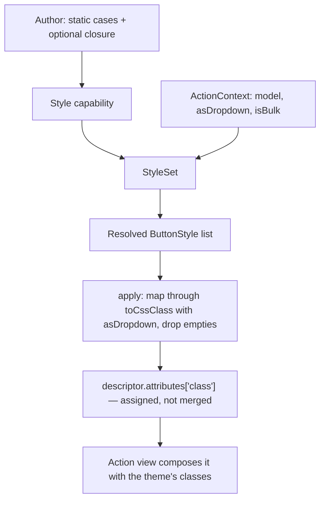

# Action Styling Parity - Plan

Extends `docs/plans/2026-08-16-2244-feat-table-styling-plan.md`, whose KD8 deferred actions "pending this release's
outcome". That outcome is in, and this closes the deferral.

## Goal Capsule

- **Objective:** Let an action's style be decided per render from context, the way a column's can, so every styling
  surface in the package is authored the same way. Release 2.0.
- **Authority hierarchy:** Key Technical Decisions below outrank unit approaches. `AGENTS.md` outranks this plan on
  repo process. The styling plan's shipped API defines what "the same" means and is not re-litigated here.
- **Execution profile:** A `feature/*` branch off `release/2.x`. One commit per implementation unit, and every unit
  leaves the tree green on its own. No PHP on the host — every command runs through Docker.
- **Stop conditions:**
  - **Never run `git commit` or `git push`.** `AGENTS.md` makes this absolute and it overrides any skill instruction.
  - Stop the `docs` compose service before any Docusaurus build.
  - Stop and ask before changing how capabilities compose. This plan changes what `Style` accepts, not the capability
    system.
- **Tail ownership:** The author commits, pushes and opens the PR. A run ending at "ready to commit, gate green" is
  complete.
- **Open blockers:** None.

---

## Product Contract

### Summary

The `Style` capability accepts a closure alongside its static cases, resolved against the `ActionContext` an action
already carries. Authoring an action's style then reads the same as authoring a column's, and an action can vary its
appearance by the row it belongs to.

### Problem Frame

Every other styling surface in the package can decide from context. A column can colour a cell by its value, a table
can colour a row by its model. An action cannot: `new Action()->with(new Style(ButtonStyle::Danger))` takes fixed cases
and nothing else, so "make this button danger only when the record is overdue" has no expression.

The gap is narrow rather than structural. `Style` already accepts several cases and combines them, and `ActionContext`
already carries the request, the config, the model, and whether the action is rendering inside a dropdown or as a bulk
action. Everything a closure would need is present; there is simply no way to supply one.

Two things this is **not** fixing, both investigated and found sound:

`Style::apply()` assigns `attributes['class']` rather than merging it, and that is deliberate — pinned by
`test_apply_overwrites_a_class_of_an_earlier_capability`. It is also correct: a button variant is replacement
semantics, and merging would emit `btn-primary btn-danger` and leave the outcome to CSS order. Cases within a single
`Style` still combine.

`ButtonStyle::Default` renders an empty class, which `apply()` already filters out, pinned by two further tests.

### Key Decisions

- KD1. **Action styling reaches parity on authoring shape, not on internals.** (session-settled: user-directed — chosen
  over leaving actions as they are: having seen the shipped API, an action's style should be declared the same way a
  column's is.) Governs R1, R2.
- KD2. **The capability keeps its shape and gains a closure; actions do not get a `style()` method of their own.**
  (session-settled: user-approved — chosen over adding a second styling entry point: `->with(new Style(...))` already
  mirrors `Column::style(...)`, and a second route would re-open the composition design that shipped with the actions
  rewrite.) Governs R2.
- KD3. **`ButtonStyle` keeps its dropdown variant.** (session-settled: user-approved — chosen over removing it the way
  the cell-level duality was removed: there the two renderings were an accident of container shape and caused issue #7,
  whereas a button inside a dropdown menu genuinely is not a button.) Governs R5.
- KD4. **The outline variants stay as paired cases.** (session-settled: user-approved — chosen over composing a
  modifier with a colour: families exist to drive type defaults, which actions have no equivalent of, so the change
  would break a published vocabulary and buy nothing.) Governs R6.

### Requirements

**Authoring shape**

- R1. An action's style can be decided per render from the context that action already carries.
- R2. Styles are declared through the existing `Style` capability, which accepts static cases and an optional closure
  in one call, in either order.
- R3. The closure receives the action's context and may return one case, several, or nothing.
- R4. Static cases and whatever the closure returns are combined, in the order declared.

**Preserved behaviour**

- R5. A style still renders its dropdown variant when the action renders inside a dropdown.
- R6. The `ButtonStyle` vocabulary is unchanged — same cases, same rendering.
- R7. A `Style` still replaces a class set by an earlier capability rather than merging with it.
- R8. A case that renders to an empty class still contributes nothing.
- R9. An action declaring no style still falls back to the theme's default class.

**Documentation**

- R10. The action styling page shows conditional styling and states which context the closure receives.
- R11. `docs/docs/upgrading.md` records the capability's widened constructor as an addition, not a break.

### Acceptance Examples

- AE1. A closure colours an action by its row
  - **Covers R1, R3, R4.**
  - **Given** a row action declaring `DangerOutline` statically and a closure returning `Danger` when the model is
    overdue,
  - **When** the table renders,
  - **Then** overdue rows show the danger button and other rows show the outlined one.

- AE2. A closure receives no model on a table action
  - **Covers R3.**
  - **Given** a table action whose closure guards on the model,
  - **When** it renders,
  - **Then** the closure runs, receives a context with no model, and only the static cases apply.

- AE3. Declaration order does not matter
  - **Covers R2.**
  - **Given** two actions, one declaring the closure before its static case and one after,
  - **When** both render,
  - **Then** they produce the same class.

- AE4. The dropdown variant survives a closure
  - **Covers R5.**
  - **Given** an action inside a dropdown whose closure returns `Danger`,
  - **When** it renders,
  - **Then** it renders the dropdown variant rather than the button class.

- AE5. Nothing changes for an action that declares no closure
  - **Covers R6, R7, R8, R9.**
  - **Given** the existing capability tests,
  - **When** they run unchanged,
  - **Then** they pass.

### Scope Boundaries

Deferred for later:

- A style vocabulary for action collections, which currently take their appearance from the collection type.

Outside this work:

- Changing how capabilities compose, or how `ActionDescriptor` carries attributes.
- Reusing `Styles/StyleResolver` for actions — see KTD3.
- Renaming `ButtonStyle`, or reworking the outline variants (KD4).

### Sources / Research

Verified on 2026-08-17 against the branch:

- `src/Actions/Capabilities/Style.php` — `final class` taking `ButtonStyle ...$styles`; `apply()` maps them through
  `toCssClass($theme, $context->asDropdown)`, drops empties with `array_filter`, and assigns `attributes['class']`.
- `tests/Unit/Actions/Capabilities/StyleTest.php` — 17 tests, including `test_apply_overwrites_a_class_of_an_earlier_capability`,
  `test_apply_does_nothing_for_the_default_style` and `test_apply_skips_the_default_style_between_other_styles`. The
  overwrite and the empty-class filtering are both intended behaviour with coverage.
- `src/Actions/Contexts/ActionContext.php` — `final readonly` carrying `request`, `config`, `model`, `asDropdown`,
  `isBulk`. Everything a closure needs is already there.
- `resources/views/actions/attributes.blade.php` — skips `class` deliberately; the action views compose it with the
  theme's own classes, e.g. `trim('btn ' . ($attributes['class'] ?? 'btn-primary'))` in `bootstrap-5/actions/http-modal.blade.php`.
- `src/Enums/ButtonStyle.php` — 22 cases; `toCssClass(Theme, bool $inDropdown = false)`.
- `docs/plans/2026-08-16-2244-feat-table-styling-plan.md` — the shipped shape this extends, and the rule under
  "Changes during implementation" about where a closure earns its place.

---

## Planning Contract

### Key Technical Decisions

- KTD1. **`ActionContext` implements `Contracts/StyleContext`.** The marker carries no methods, so this is a
  declaration rather than a change in behaviour, and it lets `ValueObjects/StyleSet` resolve against an action context
  unchanged. Governs R1, R3.
- KTD2. **The `Style` capability holds a `StyleSet` internally.** Reusing the shipped value object gets the
  order-independent argument handling, the single-or-list-or-null closure return, and the merge rule for free, all
  already covered by `StyleSetTest`. Governs R2, R3, R4.
- KTD3. **`Style::apply()` keeps its own class mapping; it does not call `StyleResolver`.** The resolver calls
  `toCssClass($theme)` with no render-context flag, so routing `ButtonStyle` through it would silently always pick the
  button variant and break dropdown rendering. Parity is about the authoring shape, not the internal helper. Governs
  R5.
- KTD4. **`ButtonStyle` implements `Contracts/Style`.** PHP permits an implementing method to add optional parameters,
  so its existing `toCssClass(Theme, bool $inDropdown = false)` satisfies the contract without changing. This is what
  lets a `StyleSet` hold it. Governs R6.
- KTD5. **The constructor widens rather than changes.** `Style(ButtonStyle|Closure ...$styles)` accepts everything the
  current signature accepts, so every existing call site and every existing test keeps working untouched. Governs R7,
  R8, R9, and is what makes AE5 a real check rather than a formality.

### High-Level Technical Design

The closure path reuses the shipped value object; the rendering path is unchanged.

### Assumptions

- No consumer subclasses `Style` or relies on its constructor rejecting non-`ButtonStyle` arguments. It is `final`, so
  subclassing is already impossible; widening the parameter type cannot break a caller that was passing valid values.
- `ActionContext` implementing a marker interface has no effect on its existing consumers. It is a `final readonly`
  class with no inheritance to disturb.

### Sequencing

U1 and U2 are independent and either can land first. U3 depends on both. U4 lands last so the documentation describes
the finished shape.

### System-Wide Impact

- **Public API.** `Style`'s constructor widens and `ButtonStyle` gains an interface. Both are additive; no existing
  usage changes.
- **Published views.** Untouched. The class attribute is produced exactly as before.
- **The styling plan.** Its KD8 deferral is closed by this document, which should be noted there rather than left
  reading as open.

### Risks & Dependencies

- **Coverage metadata is the likeliest gate failure.** `StyleTest` will start executing `StyleSet` and
  `Contracts/StyleContext`; both need `#[UsesClass]` or the suite goes risky and silently loses its coverage credit.
  This bit six times in the previous plan.
- **A stale `#[UsesClass]` collapses the entire coverage report to zero**, not just one suite. Nothing is deleted here,
  so the risk is low, but it is the failure mode to recognise.
- **`composer cs` rewrites files**, including sorting imports by length. Run it before the final test pass.
- No new dependency is required.

---

## Implementation Units

### U1. `ActionContext` joins the style contexts

- **Goal:** An action context can be handed to a `StyleSet`.
- **Requirements:** R1, R3
- **Dependencies:** none
- **Files:** `src/Actions/Contexts/ActionContext.php`, `tests/Unit/Actions/Contexts/ActionContextTest.php`
- **Approach:**
  1. Declare `Contracts/StyleContext` on `ActionContext`. The marker has no methods, so nothing else changes.
  2. Leave the fluent `asDropdown()` and `isBulk()` methods alone; they already return new instances.
- **Patterns to follow:** `src/Styles/Contexts/CellContext.php` for how the marker is declared elsewhere.
- **Test scenarios:**
  - An action context satisfies the style-context contract.
  - The fluent `asDropdown()` and `isBulk()` still return instances that satisfy it.
- **Verification:** The contract assertion passes and the existing `ActionContextTest` is otherwise untouched.

### U2. `ButtonStyle` joins the style vocabularies

- **Goal:** A button style can live in a `StyleSet`.
- **Requirements:** R6
- **Dependencies:** none
- **Files:** `src/Enums/ButtonStyle.php`, `tests/Unit/Enums/ButtonStyleTest.php`
- **Approach:**
  1. Declare `Contracts/Style` on `ButtonStyle`.
  2. Change nothing else — the existing `toCssClass(Theme, bool $inDropdown = false)` satisfies the contract because
     PHP allows an implementing method to add optional parameters, per KTD4.
- **Patterns to follow:** `src/Enums/CellStyle.php`, which satisfies the same contract while keeping an extra optional
  parameter of its own.
- **Test scenarios:**
  - A button style satisfies the style contract.
  - Every case still renders the class it rendered before, button variant and dropdown variant alike.
- **Verification:** The existing `ButtonStyleTest` passes unchanged alongside the new contract assertion.

### U3. The `Style` capability accepts a closure

- **Goal:** An action's style can be decided per render.
- **Requirements:** R2, R3, R4, R5, R7, R8, R9
- **Dependencies:** U1, U2
- **Files:** `src/Actions/Capabilities/Style.php`, `tests/Unit/Actions/Capabilities/StyleTest.php`
- **Approach:**
  1. Widen the constructor to `ButtonStyle|Closure ...$styles` and hand the arguments to a `StyleSet`, per KTD2 and
     KTD5.
  2. In `apply()`, resolve the set against the context, then map, filter and assign exactly as now — the rendering path
     does not change, per KTD3.
  3. Narrow the resolved list to `ButtonStyle` before mapping, since `StyleSet` is typed on the wider contract.
- **Execution note:** Run the existing seventeen `StyleTest` cases before touching anything and again after. They are
  the proof that the widening is additive; any change in them means the constructor changed rather than widened.
- **Patterns to follow:** `src/Column.php`'s `style()` for how statics and a closure are accepted together;
  `src/ValueObjects/StyleSet.php` for what resolution already handles.
- **Test scenarios:**
  - Covers AE1. A closure returning a case adds it to the static cases.
  - Covers AE3. Declaring the closure before the static cases produces the same class as declaring it after.
  - A closure returning several cases adds all of them.
  - A closure returning nothing leaves the static cases alone.
  - Covers AE2. The closure receives the action's context, and that context carries no model for a table action.
  - Covers AE4. Inside a dropdown, a closure-supplied case still renders the dropdown variant.
  - A closure returning only a case that renders empty leaves the descriptor untouched.
  - Covers AE5. Every existing capability test passes unchanged.
- **Verification:** The seventeen pre-existing tests are green and unmodified, and the new behaviour is covered
  alongside them.

### U4. Documentation

- **Goal:** The docs show conditional action styling and place it alongside the other levels.
- **Requirements:** R10, R11
- **Dependencies:** U1, U2, U3
- **Files:** `docs/docs/styling/action-styling.md`, `docs/docs/upgrading.md`,
  `docs/plans/2026-08-16-2244-feat-table-styling-plan.md`
- **Approach:**
  1. Add a conditional-styling section to the action styling page, naming the context the closure receives and what it
     carries.
  2. Cross-link it with cell styling so the two read as one story.
  3. Record the widened constructor under "New in 2.0" rather than as a break, since nothing existing changes.
  4. Note on the styling plan that KD8's deferral is closed and by which document.
- **Test scenarios:** `Test expectation: none -- documentation only. Link validity is covered by the docs build in the
  Verification Contract.`
- **Verification:** The Docusaurus build passes with `onBrokenLinks: throw`.

---

## Verification Contract

There is no PHP on the host. Every command runs through Docker.

| Gate | Command | Requirement |
|---|---|---|
| Tests | `docker compose run --rm -T php composer test` | Green, no risky and no warning tests |
| Coverage | `docker compose run --rm -T php php vendor/bin/phpunit -c phpunit.xml --coverage-text` | 100% lines, methods and classes; no drop |
| Static analysis | `docker compose run --rm -T php composer ps` | PHPStan clean at `level: max` over `src` |
| Code style | `docker compose run --rm -T php composer cs` | Run until it reports `Fixed 0 of N files` |
| Docs build | `docker compose run --rm -T -w /app docs npx docusaurus build` | Passes; stop the `docs` service first, and remove the root-owned `build/` afterwards the same way |

Notes that decide whether the gate passes first time:

- `StyleTest` will begin executing `StyleSet` and `Contracts/StyleContext`. Both need `#[UsesClass]` or the suite goes
  risky, and a risky test's coverage is not credited — which shows up as a coverage drop rather than as a test failure.
- Assert on precise markers rather than bare class names when checking rendered action markup; the always-emitted CSS
  and JS partials contain colour tokens that match loose assertions.

## Definition of Done

Global:

- All four units are complete, each as its own commit-ready change in the working tree.
- All five gates pass.
- Every requirement R1–R11 is satisfied or explicitly deferred in Scope Boundaries.
- Every acceptance example AE1–AE5 has a corresponding passing test.
- The seventeen pre-existing `StyleTest` cases are unmodified and green, proving the constructor widened rather than
  changed.
- KD8's deferral on the styling plan is marked closed.
- **No commit and no push has been made.** The work sits in the tree with a commit message handed over per unit.

Per unit: the unit's test scenarios pass, its cited requirements hold, and the full gate is green before the next unit
starts.
