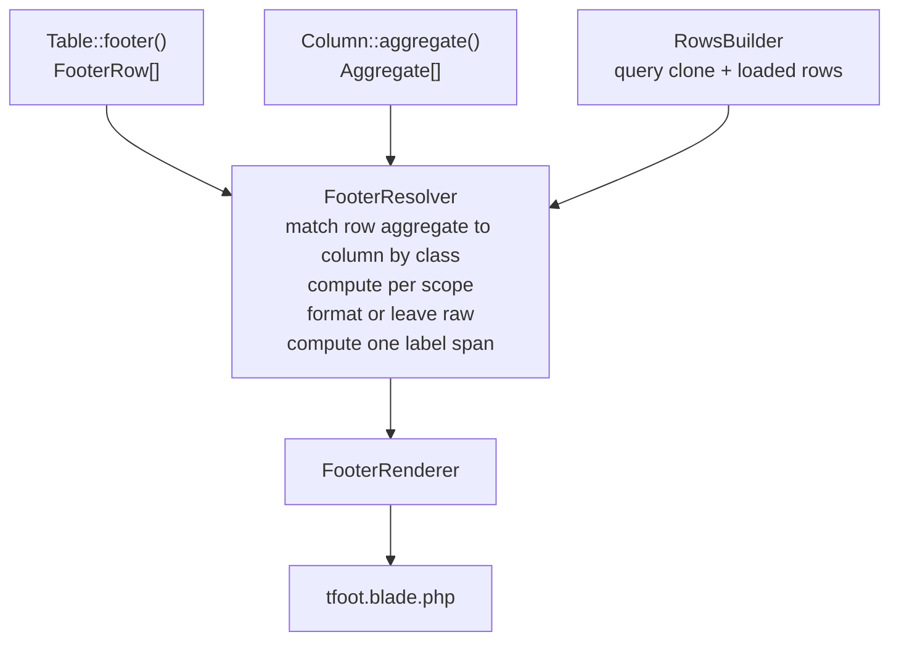

# Footer Aggregates - Plan

## Goal Capsule

- **Objective:** Give a table a footer that renders per-column aggregates, so a reader can see a total, an average or a median for the rows in front of them and for the whole filtered result set. Release 2.0.
- **Product authority:** This plan owns the footer as a home for column aggregates. A footer that carries arbitrary content is not active scope. See Scope Boundaries.
- **Authority hierarchy:** Key Technical Decisions outrank unit approaches. Product Contract Key Decisions outrank KTDs on what the feature does. `AGENTS.md` outranks this plan on repo process. The shipped styling API defines the contract-plus-vocabularies shape and is not re-litigated here.
- **Execution profile:** A `feature/*` branch off `release/2.x`. One commit per implementation unit, and every unit leaves the tree green on its own. No PHP on the host, every command runs through Docker.
- **Stop conditions:**
  - **Never run `git commit` or `git push`.** `AGENTS.md` makes this absolute and it overrides any skill instruction.
  - Stop the `docs` compose service before any Docusaurus build.
  - Stop and ask before changing what a footer row means or how a column opts in. Those are Product Contract decisions, not implementation choices.
- **Tail ownership:** The author commits, pushes and opens the PR. A run ending at "ready to commit, gate green" is complete.
- **Open blockers:** None.

**Product Contract preservation:** unchanged. Planning added the Planning Contract, Implementation Units, Verification Contract and Definition of Done below without altering any R, KD or AE.

---

## Product Contract

### Summary

A table gains a footer composed of author-declared rows. Each row renders one aggregate at one scope across the columns that opted into that aggregate. Aggregates are classes rather than a fixed list, so a project can add its own alongside the ones the package ships.

### Problem Frame

A table that lists amounts invites the question "what does that come to". Today the package has no answer. `TableRegion::Footer` exists in `src/Enums/TableRegion.php` and `resources/views/bootstrap-5/table/tfoot.blade.php` is included by the table view, but that file is empty. The seam was cut and never filled.

Pagination makes the question ambiguous rather than merely unanswered. A visitor looking at page three of an invoice list may want the total of the twenty rows on screen, or the total of every invoice matching their filters. Those are different numbers, and a table that silently picks one will be wrong for half its readers.

The request is speculative. No table in a consuming application needs this yet, and the issue carries `priority:low` with no date. That matters for how much gets built: the risk is not shipping too little, it is committing to an abstraction that a real use case later contradicts. Release 2.0 is the window where the shape can still change without a major version, which is why the work is worth doing now rather than after evidence arrives.

### Key Decisions

- KD1. **The footer is an ordered list of author-composed rows, each carrying one aggregate at one scope.** (session-settled: user-directed, chosen over showing both scopes together in one cell and over one scope per column: composing rows scales to any number of aggregates and lets each row be labelled.) Governs R1, R2.
- KD2. **A column opts into the aggregates it offers, and a row selects one.** (session-settled: user-directed, chosen over rows naming their own columns and over aggregating anything numeric automatically: an id, a year or a postcode must never be summed by accident, and the declaration belongs beside the column like `sortable` and `searchable`.) Governs R3.
- KD3. **Aggregates are classes implementing a package contract, not a closed enum.** (session-settled: user-directed. Mirrors how `Contracts\Style` admits both package vocabularies and user-defined ones.) Governs R4, R5.
- KD4. **An aggregate that cannot answer a scope returns nothing, and the cell renders empty.** (session-settled: user-approved, chosen over the package maintaining a list of which aggregates support which scope: one rule covers a median with no portable SQL form and a `valueUsing` column with no database column, and the aggregate itself decides rather than the package.) Governs R6, R7, R13.
- KD5. **Each aggregate declares whether it returns the column's unit.** (session-settled: user-directed, chosen over always reusing the column formatter and over the aggregate carrying its own: a sum of a money column is money, a count of the same column is not.) Governs R8.
- KD6. **Row labels align across the whole footer.** (session-settled: user-directed. Aligning to the leftmost column that any row aggregates keeps stacked figures comparable, which is the reason for stacking them.) Governs R10.
- KD7. **Six aggregates ship: sum, average, median, count, min and max.** (session-settled: user-directed, chosen over shipping only the three named in dialogue and over also shipping mode: everything with a portable SQL form earns its place, and mode is rare in a footer and has no portable form.) Governs R12.
- KD8. **An empty result set is not a special case; each aggregate answers for itself.** (session-settled: user-directed, chosen over hiding the footer, blanking every cell, and zeroing every cell: it reuses KD4's rule rather than adding a second one, and an average of no rows is not zero.) Governs R6.
- KD9. **Grand totals cost extra queries and the author is not warned.** (session-settled: user-directed, chosen over surfacing the cost: asking for a total across the filtered set is an explicit act, and a warning would be noise.) Governs R7.

### Requirements

**Declaring the footer**

- R1. A table declares a footer as an ordered list of rows. A table that declares none renders no footer.
- R2. A footer row carries one aggregate, one scope, and a label. Scope is either the rows on the current page or the whole filtered result set.
- R3. A column declares which aggregates it offers. A footer cell renders only where the row's aggregate is one the column offers; every other cell in that row is empty.

**Aggregates**

- R4. An aggregate is a class satisfying a package contract, so a project can supply its own without modifying the package.
- R5. An aggregate computing the current page receives the values on that page. An aggregate computing the whole set receives the query, so it can push the work into the database.
- R6. An aggregate that has no answer returns nothing, and that cell renders empty rather than showing a zero or an error. This covers a scope the aggregate cannot compute and a result set with no rows alike.
- R7. A total-scope aggregate runs against the query after search, filters and sorting have been applied, so it reflects what the reader is looking at. Each one may cost its own query.

**Rendering**

- R8. An aggregate declares whether its result carries the column's unit. When it does, the value renders through the column's formatter; when it does not, it renders unformatted.
- R9. A footer row's label sits in a cell spanning the leading columns. A row may name a different column for its label instead.
- R10. The label span ends at the leftmost column that any footer row aggregates, so every row's label covers the same columns.
- R11. A footer renders inside the table's `tfoot`, and its rows are styleable through the styling API that table, row, column, cell and accent styling already use.

**Built-in aggregates**

- R12. The package ships sum, average, median, count, min and max. Sum, average, count, min and max answer both scopes. Median answers the current page only.
- R13. Sum and count return zero for an empty set. Average, median, min and max return nothing, so their cells render empty.

### Acceptance Examples

- AE1. Two scopes of one aggregate
  - **Covers R1, R2, R3.**
  - **Given:** An invoice table paginated at 20 per page, with an `amount` column offering a sum, and a footer declaring a page-scoped sum row labelled "This page" and a total-scoped sum row labelled "All invoices".
  - **Then:** The footer shows two rows. "This page" totals the 20 amounts on screen. "All invoices" totals every invoice matching the current filters.

- AE2. A column that did not opt in
  - **Covers R3.**
  - **Given:** The same table, where `invoice_number` offers no aggregates.
  - **Then:** Both footer rows leave the `invoice_number` cell empty. No number is ever shown under it.

- AE3. An aggregate with no portable total
  - **Covers R6.**
  - **Given:** An `amount` column offering a median, and a footer declaring a total-scoped median row.
  - **Then:** The cell is empty, because a median has no portable SQL form. A page-scoped median row on the same column renders a value.

- AE4. A computed column
  - **Covers R6.**
  - **Given:** A `line_total` column whose value comes from a closure rather than a database column, offering a sum.
  - **Then:** A page-scoped sum renders, because the values are loaded. A total-scoped sum leaves the cell empty.

- AE5. Unit-carrying and unit-changing aggregates
  - **Covers R8.**
  - **Given:** An `amount` column formatted as currency, with a footer declaring a sum row and a count row.
  - **Then:** The sum renders as currency. The count renders as a plain number.

- AE6. Label alignment across rows
  - **Covers R9, R10.**
  - **Given:** Columns `name`, `region`, `amount` and `quantity`, where `amount` and `quantity` offer a sum but only `amount` offers a median, and the footer declares a sum row and a median row.
  - **Then:** Both labels span `name` and `region`, because `amount` is the leftmost aggregated column in the footer as a whole. The median row leaves its `quantity` cell empty.

- AE7. An empty result set
  - **Covers R6, R13.**
  - **Given:** A table whose filters match no rows, with footer rows declaring a sum, an average and a count on the `amount` column.
  - **Then:** The footer renders. Sum and count show zero. Average leaves its cell empty.

### Scope Boundaries

- **A footer that carries arbitrary content.** Notes, prose, a row count sentence, actions, or a pagination summary. The footer is a home for column aggregates only. The dialogue explored a general content region and rejected it, because the requested content was entirely aggregates.
- **Grouped or subtotal rows.** A footer aggregates the result set, not runs within it. Subtotals per group would need a grouping concept the package does not have.
- **A header-side equivalent.** Aggregates render below the rows, not above them.
- **Themes other than Bootstrap 5.** The package supports one theme, and this feature does not change that.
- **Caching or memoising totals across requests.** Each render computes what it needs.

### Dependencies / Assumptions

- A1. `TableRegion::Footer` already exists and is the region this feature renders into.
- A2. `resources/views/bootstrap-5/table/tfoot.blade.php` exists, is empty, and is already included by the table view, so no change to the table's structure is needed to reach it.
- A3. The query available at pagination time in `src/Builders/RowsBuilder.php` already has search, filters and sorting applied, so a total-scope aggregate can clone it without rebuilding.
- A4. Sum, average, count, min and max have portable SQL forms across the databases Laravel supports. Median and mode do not.
- A5. Release 2.0 is unreleased, so this API can be shaped freely and needs no deprecation path.

### Outstanding Questions

**Deferred to Planning**

- Q3. Whether several total-scope aggregates can be folded into a single query. Aggregates that compile to SQL could share one `SELECT`, but a custom aggregate class receiving the query cannot be folded in with the others. KD7 accepts the cost either way, so this is an optimisation rather than a product decision.
- Q4. How a footer row's styles resolve relative to column and cell styles, given `TableRegion::Footer` already exists and the styling API is settled.

### Sources / Research

- `src/Enums/TableRegion.php` — carries the `Footer` case this feature renders into.
- `resources/views/bootstrap-5/table/tfoot.blade.php` — the empty partial already wired into the table view.
- `src/Builders/RowsBuilder.php` — where search, filters and sorting are applied and the query is paginated, which is the point a total-scope aggregate would branch from.
- `src/Column.php` — the column declaration this feature extends, and the home of `valueUsing`, which is why some columns can never have a grand total.
- `docs/plans/2026-08-16-2244-feat-table-styling-plan.md` — the styling API whose contract-plus-vocabularies shape KD3 mirrors.
- GitHub issue #8, "Sum in footer", milestone Release 2.0.

---

## Planning Contract

### Key Technical Decisions

- KTD1. **`Contracts\Aggregate` carries three methods: one per scope, plus a unit declaration.** The two scope methods return `null` when the aggregate has no answer, which is how R6 is satisfied without the package keeping a table of what supports what. Mirrors `Contracts\Style` admitting both package vocabularies and user-defined ones. Governs R4, R5, R6.
- KTD2. **The row names the aggregate; the column's instance computes it.** A footer row's aggregate is matched against a column's declared aggregates by class, and the column's instance does the work. A column can therefore configure its own rounding or precision while a row says only "sum".
  - Rejected: the row's instance computing. It reads more directly but leaves a column no way to configure its own aggregate, and two rows naming the same aggregate would silently disagree.
  - Governs R3.
- KTD3. **`Formatter::format()` takes an optional model.** (session-settled: user-directed, chosen over refusing to format footer values and over passing an arbitrary row: a footer value has no row, and every shipped formatter already ignores the argument.) Governs R8.
- KTD4. **A formatter whose parameters include a closure is skipped in the footer, and the raw value renders.** (session-settled: user-directed, chosen over refusing to aggregate such a column: a closure parameter resolves against a row, and a footer has none, so a visible unformatted total beats no total at all.) Governs R8.
- KTD5. **Total-scope aggregates run against a clone of the query taken in `RowsBuilder` after search, filters and sorting and before pagination.** That is the only point where the fully-narrowed query exists, and cloning keeps the paginated query untouched. Governs R7.
- KTD6. **Each total-scope aggregate runs its own query in this release.** Folding SQL-compilable aggregates into one `SELECT` is possible but cannot include a custom aggregate that receives the query, so the contract would have to expose which aggregates are foldable before anyone has felt the cost. Governs R7.
- KTD7. **Value resolution is extracted out of `ColumnValueRenderer` into a shared service before the footer needs it.** Page-scope aggregation needs each column's value for each loaded row, which is the same `valueUsing`-or-attribute step the cell renderer already performs. Extracting it keeps one definition of what a column's value is. Governs R5.
- KTD8. **The label span is computed once for the whole footer, from the union of columns any row aggregates.** Governs R10.
- KTD9. **A footer row is a value object and the table declares them from an overridable `footer()` method returning an empty array by default.** Matches how `style()`, `rowStyle()` and `accentStyle()` are declared. Governs R1, R2.

### High-Level Technical Design

Cell resolution for one footer row and one column:

1. The column offers no aggregate of the row's class, so the cell is empty. Otherwise continue.
2. The row's scope selects the method. Page hands the aggregate the column's values for the loaded rows; total hands it the cloned query and the column name.
3. The aggregate returns `null`, so the cell is empty. Otherwise continue.
4. The aggregate carries the column's unit and the column's formatter has no closure parameters, so the value renders through that formatter. Otherwise it renders raw.

Cell count per footer row matches a body row: one optional leading checkbox cell, one cell per column, one optional trailing actions cell.

### Assumptions

- A1. No shipped formatter reads its `$model` argument. Verified: it appears only in the signature and docblock of all four classes in `src/Formatters/`.
- A2. `SUM()` over no rows returns `NULL` in every database Laravel supports, so a total-scope sum has to coalesce to zero itself to satisfy R13. `COUNT()` already returns zero.
- A3. A column's `valueUsing` closure returns a raw value rather than presentation markup, so page-scope aggregation over its output is meaningful.
- A4. `feature/*` is cut from `release/2.x` with the action styling work merged.

### Sequencing

U1 → U2 → U3 → U4 → U5 → U6 → U7 → U8 → U9.

U1 is the contract everything else names. U2 and U3 both depend only on U1 and could land in either order. U4 and U5 are independent preparations that U7 needs. U6 supplies the query U7 needs for total scope. U8 renders what U7 produces. U9 documents the finished surface.

### System-Wide Impact

| Area | Change |
|---|---|
| `src/Contracts/Aggregate.php` | New |
| `src/Enums/AggregateScope.php` | New |
| `src/Aggregates/` | New: `Sum`, `Average`, `Median`, `Count`, `Min`, `Max` |
| `src/ValueObjects/FooterRow.php` | New |
| `src/Footers/FooterResolver.php`, `src/Footers/FooterRenderer.php` | New |
| `src/Columns/ColumnValue.php` | New, extracted from `ColumnValueRenderer` |
| `src/Contracts/Formatter.php` | Signature widened |
| `src/Formatters/*.php` | Four signature updates |
| `src/Column.php` | New `aggregates` property and `aggregate()` method |
| `src/Table.php` | New `footer()` method |
| `src/Builders/RowsBuilder.php` | Exposes the pre-pagination query |
| `src/Tables/TableRenderer.php` | Passes footer data to the view |
| `resources/views/bootstrap-5/table/tfoot.blade.php` | Filled |
| `tests/Resources/TestFormatter.php` | Signature update |
| Documentation | New footer page, upgrading entry, column and table reference updates |

### Risks & Dependencies

- **R-1. The formatter widening reaches every custom formatter a consumer wrote.** 2.0 is a hard break already and the release is unpublished, so the cost is a documentation entry rather than a migration. Mitigation: `upgrading.md` names the signature change explicitly in U9.
- **R-2. Total-scope aggregates multiply queries.** A footer with three total rows over two columns is six extra queries per render. Accepted by KD9 and KTD6. Mitigation: U9 documents the cost so an author can weigh it, and Q3 stays open for a later optimisation.
- **R-3. Extracting value resolution touches the hot path.** `ColumnValueRenderer` renders every cell of every row. A regression there is a regression everywhere. Mitigation: U5 is a pure extraction with no behaviour change, and the existing cell tests are the proof.
- **R-4. Coverage metadata.** Every test class that renders a table will begin executing the new aggregate and footer classes. Missing `#[UsesClass]` produces risky tests and collapses the report. Mitigation: named in the Verification Contract and expected at each unit boundary.

---

## Implementation Units

### U1. The aggregate contract and its scopes

- **Goal:** A package contract exists that an aggregate satisfies, and a vocabulary for the two scopes.
- **Requirements:** R4, R5, R6
- **Files:** `src/Contracts/Aggregate.php`, `src/Enums/AggregateScope.php`, `tests/Resources/TestAggregate.php`, `tests/Unit/Enums/AggregateScopeTest.php`
- **Approach:**
  1. Declare `Contracts\Aggregate` with a page method receiving the column's values, a total method receiving the query and the column name, and a method declaring whether the result carries the column's unit.
  2. Both scope methods return a nullable value so an aggregate can decline a scope, per KTD1.
  3. Declare `Enums\AggregateScope` with `Page` and `Total`.
  4. Add a test double under `tests/Resources/` that returns a fixed value, so later units can assert against a known aggregate.
- **Patterns to follow:** `src/Contracts/Style.php` for a minimal contract, `tests/Resources/TestStyle.php` for the double.
- **Test scenarios:**
  - The scope enum has exactly two cases.
  - The test double satisfies the contract, and an aggregate returning null for a scope is a legal implementation.
- **Verification:** The contract is satisfiable by a class that answers only one scope.

### U2. The six built-in aggregates

- **Goal:** Sum, average, median, count, min and max ship with the package.
- **Requirements:** R12, R13
- **Dependencies:** U1
- **Files:** `src/Aggregates/Sum.php`, `src/Aggregates/Average.php`, `src/Aggregates/Median.php`, `src/Aggregates/Count.php`, `src/Aggregates/Min.php`, `src/Aggregates/Max.php`, and a test class per aggregate under `tests/Unit/Aggregates/`
- **Approach:**
  1. Sum, average, count, min and max answer both scopes. Median answers the page only and returns null for the total, per R12.
  2. Sum, average, min and max carry the column's unit. Count does not, per R8.
  3. Sum and count return zero for an empty set. The rest return null, per R13. A total-scope sum coalesces the `NULL` that SQL returns for an empty set, per A2.
- **Execution note:** Write each aggregate's empty-set case before its populated case. The empty set is where R13 and A2 actually bite, and it is the case most likely to be assumed rather than tested.
- **Test scenarios:**
  - Each aggregate returns the correct value for a populated page and for a populated query.
  - Covers R13. Sum and count return zero for an empty page and an empty query; average, median, min and max return null for both.
  - Covers AE3. Median returns null for the total scope regardless of the query.
  - Each aggregate reports whether it carries the column's unit, and count is the only one that does not.
  - A total-scope sum over a query matching no rows returns zero rather than null.
- **Verification:** Every aggregate is exercised at both scopes, populated and empty.

### U3. Declaring a footer and opting a column in

- **Goal:** A table declares footer rows and a column declares the aggregates it offers.
- **Requirements:** R1, R2, R3
- **Dependencies:** U1
- **Files:** `src/ValueObjects/FooterRow.php`, `src/Column.php`, `src/Table.php`, `tests/Unit/ValueObjects/FooterRowTest.php`, `tests/Unit/ColumnTest.php`, `tests/Unit/TableTest.php`
- **Approach:**
  1. `FooterRow` carries the aggregate, the scope, the label, and an optional column name for the label, per KTD9 and R9.
  2. `Column` gains an aggregates property and a variadic `aggregate()` method that appends rather than replaces, matching `Column::style()`.
  3. `Table::footer()` returns an empty array by default, matching how `rowStyle()` and `style()` default.
- **Approach note:** Nothing renders yet. This unit is the declaration surface only.
- **Patterns to follow:** `src/Column.php` `style()` for the variadic appending method, `src/Table.php` `rowStyle()` for the overridable default.
- **Test scenarios:**
  - `aggregate()` returns the column for chaining, and a second call appends rather than replacing.
  - A column with no declared aggregates reports an empty list.
  - A footer row carries its aggregate, scope and label, and its label column is null unless given.
  - A label may be a closure as well as a string.
  - A table declares no footer rows by default, and a subclass overriding `footer()` returns its own.
- **Verification:** A table and column can express every shape AE1 through AE6 need, with nothing rendering yet.

### U4. A formatter no longer requires a row

- **Goal:** A value can be formatted without a model, so a footer value can reuse a column's formatter.
- **Requirements:** R8
- **Dependencies:** None
- **Files:** `src/Contracts/Formatter.php`, `src/Formatters/CurrencyFormatter.php`, `src/Formatters/DateFormatter.php`, `src/Formatters/DateTimeFormatter.php`, `src/Formatters/NumberFormatter.php`, `tests/Resources/TestFormatter.php`, `tests/Unit/Formatters/*`
- **Approach:**
  1. Widen `Formatter::format()` so the model argument is optional, per KTD3.
  2. Update the four shipped formatters and the test double to match. None reads the argument, per A1, so no body changes.
- **Execution note:** Run the existing formatter tests before and after. They are the proof that widening changed no behaviour, so none of their expected values should move.
- **Test scenarios:**
  - Each shipped formatter produces the same output with a model and without one.
  - A formatter called with no model returns a formatted value rather than throwing.
- **Verification:** Every pre-existing formatter assertion passes with its original expected value.

### U5. A column's value without rendering a cell

- **Goal:** The value of a column for a model can be resolved without building a view.
- **Requirements:** R5
- **Dependencies:** None
- **Files:** `src/Columns/ColumnValue.php`, `src/Columns/ColumnValueRenderer.php`, `tests/Unit/Columns/ColumnValueTest.php`, `tests/Unit/Columns/ColumnValueRendererTest.php`
- **Approach:**
  1. Extract the `valueUsing`-or-attribute step out of `ColumnValueRenderer::build()` into a small service, per KTD7.
  2. `ColumnValueRenderer` calls the new service. Its rendered output does not change.
- **Execution note:** This is a pure extraction on the hottest path in the package, per R-3. The existing cell tests are the safety net; if one needs its expected value edited, the extraction changed behaviour and should stop.
- **Patterns to follow:** `src/Styles/StyleResolver.php`, which was extracted the same way out of the two column renderers.
- **Test scenarios:**
  - A column with `valueUsing` resolves through the closure, receiving the model.
  - A column without `valueUsing` resolves the model attribute of the same name.
  - A missing attribute resolves to null rather than throwing.
  - Every pre-existing `ColumnValueRenderer` assertion passes unchanged.
- **Verification:** The rendered cell output is byte-identical to before the extraction.

### U6. The narrowed query reaches the footer

- **Goal:** A total-scope aggregate can run against the same query the rows came from.
- **Requirements:** R7
- **Dependencies:** None
- **Files:** `src/Builders/RowsBuilder.php`, `tests/Unit/Builders/RowsBuilderTest.php`
- **Approach:**
  1. Retain a clone of the query taken after search, filters and sorting are applied and before `paginate()` or `get()`, per KTD5.
  2. Expose it so the renderer can hand it to an aggregate. Cloning keeps the paginated query untouched.
- **Test scenarios:**
  - The exposed query reflects an applied search term.
  - The exposed query reflects applied filters.
  - Covers R7. Running an aggregate against the exposed query does not disturb the rows the builder returns, and the paginator still reports the same total.
  - The exposed query is available whether the table paginates or not.
  - Requesting it before `build()` has run returns nothing rather than a half-built query.
- **Verification:** Row output is unchanged by the query being exposed and consumed.

### U7. Resolving the footer

- **Goal:** Footer rows and columns combine into cells, with the label span computed once.
- **Requirements:** R3, R5, R6, R8, R10
- **Dependencies:** U1, U2, U3, U4, U5, U6
- **Files:** `src/Footers/FooterResolver.php`, `tests/Unit/Footers/FooterResolverTest.php`
- **Approach:**
  1. For each footer row, match its aggregate against each column's declared aggregates by class and compute with the column's instance, per KTD2.
  2. Select the scope method per R5, handing page scope the column's values via the U5 service and total scope the U6 query.
  3. A null result leaves the cell empty, per R6.
  4. Format through the column's formatter when the aggregate carries the column's unit and the formatter has no closure parameters, per KTD3 and KTD4. Otherwise render raw.
  5. Compute the label span once from the union of columns any row aggregates, per KTD8, accounting for the leading checkbox cell when bulk actions render.
- **Test scenarios:**
  - Covers AE1. A page-scoped and a total-scoped row over the same column produce different values.
  - Covers AE2. A column offering no aggregates yields an empty cell in every row.
  - Covers AE3. A total-scoped median yields an empty cell while a page-scoped median yields a value.
  - Covers AE4. A `valueUsing` column yields a page value and an empty total.
  - Covers AE5. A unit-carrying aggregate renders through the column formatter; a count renders raw.
  - Covers AE6. Two rows aggregating different column sets produce the same label span.
  - Covers AE7. An empty result set yields zero for sum and count and empty cells for the rest.
  - Covers KTD2. A column configuring its own aggregate instance wins over a row naming the same aggregate class.
  - Covers KTD4. A column whose formatter takes a closure parameter renders its footer value unformatted.
  - A row naming an aggregate no column offers produces a row of empty cells.
  - The label span accounts for the leading checkbox cell when bulk actions render and not when they do not.
  - A row naming a label column places its label there instead of spanning.
- **Verification:** Every acceptance example in the Product Contract has a passing test.

### U8. Rendering the footer

- **Goal:** A declared footer appears in the table's `tfoot`.
- **Requirements:** R1, R9, R11
- **Dependencies:** U7
- **Files:** `src/Footers/FooterRenderer.php`, `src/Tables/TableRenderer.php`, `resources/views/bootstrap-5/table/tfoot.blade.php`, `tests/Unit/Footers/FooterRendererTest.php`, `tests/Unit/Tables/TableRendererTest.php`
- **Approach:**
  1. `FooterRenderer` turns resolved rows into view data.
  2. `TableRenderer` passes it alongside the existing `rows` and `columns` data.
  3. Fill `tfoot.blade.php`. A table declaring no footer rows renders no `tfoot` content at all, per R1.
  4. Cell count matches a body row, including the optional leading checkbox cell and trailing actions cell.
- **Test scenarios:**
  - A table with no declared footer renders no footer markup.
  - A table with one footer row renders one `tr` inside `tfoot`.
  - Covers R9. The label renders in a spanning cell, and a row naming a label column renders it there.
  - The footer row has the same cell count as a body row, with and without bulk actions and row actions.
  - Covers R11. A footer row carries the classes its declared styles resolve to.
  - A closure label is resolved.
  - Covers AE1. A rendered footer shows the page total and the grand total as separate rows.
- **Verification:** The rendered table is unchanged for any table that declares no footer.

### U9. Documentation

- **Goal:** The footer is documented, and the formatter break is recorded for upgraders.
- **Requirements:** R1 through R13
- **Dependencies:** U1 through U8
- **Files:** `docs/docs/footers.md`, `docs/docs/columns.md`, `docs/docs/upgrading.md`, `docs/docs/styling/table-styling.md`
- **Approach:**
  1. A new page covering declaring footer rows, opting a column in, the two scopes, the built-in aggregates, and writing a custom aggregate.
  2. State plainly which aggregates answer which scopes, and that a `valueUsing` column has no grand total.
  3. Record the query cost of total-scope rows, per R-2.
  4. Add the `Formatter::format()` signature change to `upgrading.md` as a break, per R-1.
  5. Cross-link column aggregates from `columns.md` and footer styling from `table-styling.md`.
  6. No em dashes, per the documentation style rule.
- **Test scenarios:** `Test expectation: none, documentation only. Link validity is covered by the docs build.`
- **Verification:** The Docusaurus build passes with `onBrokenLinks: throw`.

---

## Verification Contract

Every unit ends with the full gate, run through Docker:

| Gate | Command | Bar |
|---|---|---|
| Tests | `docker compose run --rm -T php php vendor/bin/phpunit -c phpunit.xml` | Green, no risky tests |
| Coverage | `--coverage-text` | 100% classes, methods and lines |
| Static analysis | `docker compose run --rm -T php composer ps` | No errors |
| Style | `docker compose run --rm -T php composer cs` | `Fixed 0 of N files` on the second run |
| Docs (U9) | `docker compose run --rm -T docs npm run build` | Success, `docs` service stopped first |

Coverage note: every test class that renders a table begins executing the new aggregate, resolver and renderer classes at U8. Each needs `#[UsesClass]` for them, or PHPUnit reports risky tests and the report collapses to zero. This bit the styling and action work repeatedly, per R-4.

Two behaviour-preservation checks matter more than the rest. After U4, every formatter assertion passes with its original expected value. After U5, rendered cell output is byte-identical.

## Definition of Done

- A table declaring footer rows renders them, and a table declaring none renders no footer markup.
- Sum, average, median, count, min and max ship, each answering the scopes R12 states and no others.
- An aggregate with no answer leaves its cell empty, for an unsupported scope, a `valueUsing` column, and an empty result set alike.
- A unit-carrying aggregate renders through the column's formatter; a count renders raw; a closure-parameter formatter is skipped.
- Every footer row's label spans the same columns.
- A project can add an aggregate class of its own without modifying the package.
- Every acceptance example AE1 through AE7 has a passing test.
- The four gates are green at every unit boundary, and the docs build passes at U9.
- The author has a one-line commit message per unit and has committed nothing on the agent's behalf.
