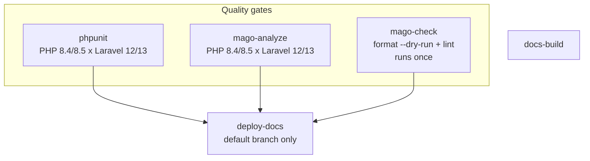

# Switch to Mago - Plan

## Goal Capsule

- **Objective:** Make Mago the single tool that formats, lints, and statically analyses this package, replacing PHP-CS-Fixer and PHPStan, with the analyzer scoped to `src`.
- **Product authority:** Issue #30, milestone 2.1. Bringing `tests` under static analysis is a separate issue in the same milestone and is not active scope here.
- **Authority order:** Product Contract requirements (R-IDs) win on what must be true. Key Technical Decisions (KTD-IDs) win on mechanism within those constraints. Implementation units override neither.
- **Execution profile:** Tooling migration. Each unit is sized to leave the repository green on its own, because two formatters cannot both gate the same files.
- **Tail ownership:** The author commits and pushes. `AGENTS.md` carries a hard rule that no agent may run `git commit` or `git push`. Leave the work in the working tree and hand over a commit message per unit. This overrides any execution step that would commit.
- **Stop conditions:** Stop and ask if the analyzer or linter triage would require changing package behavior beyond a genuine defect fix, or if a Mago finding contradicts a Product Contract requirement.
- **Open blockers:** None.

**Product Contract preservation:** unchanged. The four `Deferred to Planning` questions the brainstorm recorded are resolved in place by KTD1 through KTD4 and removed from Outstanding Questions rather than left standing.

---

## Product Contract

### Summary

Mago becomes the one tool that formats, lints, and analyses this package, run from the existing `php` Docker service with no host installation. The analyzer keeps today's `src`-only scope. The configuration that results is written to be lifted to a larger Laravel codebase.

### Problem Frame

Two tools cover code quality today, and the case against them is not speed. PHPStan runs at `level: max` over `src` in 6.4 seconds across 86 files. PHP-CS-Fixer covers 169 files in 2.7 seconds. At this size neither number is felt.

The cost is the annotation burden. Reaching `level: max` requires enough docblock scaffolding that `tests` was excluded from analysis rather than accept the volume of `@phpstan-ignore` comments it would take. That exclusion leaves 14,923 lines across 82 test files with no static analysis, against 4,809 lines in `src` that have it. Three-quarters of the PHP in the repository is unchecked, and the reason is the tool's demands rather than a judgement that tests do not need checking.

A second reason sits outside this repository. The same PHPStan configuration on a work codebase takes minutes per run, and whether to move that codebase to Mago is a live question. This package is a cheap place to answer it: 86 source files, one maintainer, and no consumer of the tooling beyond the maintainer and the agents working in it.

### Key Decisions

- **Mago replaces both tools rather than running alongside them.** (session-settled: user-directed — chosen over keeping PHP-CS-Fixer plus PHPStan, and over a non-blocking trial for 2.1: one toolchain, and a low-cost rehearsal for the same decision on a larger codebase.) Governs R1, R2.
- **The analyzer stays scoped to `src`.** (session-settled: user-directed — chosen over analysing `src` and `tests` together: keeps the cost of the tool swap separable from the cost of analysing 15k lines of tests for the first time.) Governs R6.
- **The analysis contract is redefined, not ported.** Mago's maintainers state that a 1:1 match with PHPStan is not a goal, and porting PHPStan's contract faithfully would reimport the annotation burden that motivated the change. Governs R7.
- **`vendor/` is a symbol source, not an analysis target.** Without it Mago cannot resolve Illuminate classes, and reports 616 issues against `src` where it otherwise reports 90. Governs R4.

<!-- ce-section: work-relationships -->
### How This Work Fits Together

This plan owns one area: the tool swap, with the analyzer scoped to `src`. The breakdown below is the current understanding of the surrounding work, not a committed roadmap.

- Analysing `tests` with Mago
  - Depends on this plan, which establishes the analyzer and its rule set.
  - Shares the configuration file this plan creates.
  - Still to decide: whether roughly a thousand additional findings are worth the triage. The `src` triage in this plan is the evidence for that call.
- Moving the work codebase off PHPStan
  - Can proceed independently of this plan.
  - Depends on the finding record from R7 as its evidence, and is the reason R11 exists.

### Requirements

**Toolchain and environment**

- R1. Mago is the only tool enforcing formatting, linting, and static analysis; PHP-CS-Fixer and PHPStan are removed from `require-dev` and their configuration files deleted.
- R2. Mago runs inside the existing `php` Docker service and requires no installation on the host.
- R3. Composer scripts expose the Mago gates, following the shape of the existing `cs`, `ps`, and `test` scripts.
- R4. Mago's configuration names `src` as the analysis path and `vendor` as a symbol source.

**Rule equivalence**

- R5. Formatting settings reproduce the current PHP-CS-Fixer preferences wherever Mago exposes an equivalent option.
- R6. The analyzer covers `src` and does not cover `tests`.
- R7. Every analyzer and linter finding is either fixed or suppressed with a stated reason, rather than absorbed by a wholesale baseline.
- R8. `snake_case` test method naming survives the switch.

**CI and documentation**

- R9. CI runs the Mago gate, and no CI job invokes PHP-CS-Fixer or PHPStan.
- R10. The quality-gate section of `AGENTS.md` describes the gates that exist after the switch.

**Portability**

- R11. The configuration carries no assumption specific to this package beyond its paths, so it can be lifted to another Laravel codebase.

### Acceptance Examples

- AE1. **Covers R5.** **Given** the current preference to sort imports by length, **when** Mago formats a file with several imports, **then** they are ordered shortest first.
- AE2. **Covers R5.** **Given** a PHP-CS-Fixer preference for which Mago exposes no equivalent option, **when** the switch lands, **then** the divergence is recorded rather than worked around.
- AE3. **Covers R7.** **Given** an analyzer finding judged to be a false positive, **when** it is suppressed, **then** the suppression states why.
- AE4. **Covers R1, R9.** **Given** the switch has landed, **when** CI runs on a pull request, **then** no job invokes PHP-CS-Fixer or PHPStan.
- AE5. **Covers R8.** **Given** a test method named in `snake_case`, **when** the Mago linter runs, **then** it reports no naming complaint.

### Success Criteria

- The quality gate is one command for formatting, linting, and analysis instead of two, and `AGENTS.md` reflects the reduced gate count.
- The full local gate runs faster than today. Analysis alone measured 6.4s under PHPStan and 1.6s under Mago against the same `src`.
- The 90 analyzer findings on `src` end up with a record of which were real defects and which were false positives. That record, not the green gate, is what the work-codebase decision consumes.

### Scope Boundaries

- Analysing `tests` with the Mago analyzer. Separate issue, same milestone.
- Mago's architectural guard. No current need.
- The work-codebase migration itself.
- Behavioural change to the package. The switch is tooling-only; a genuine defect surfaced by a Mago finding is fixed as its own change, not folded into the migration.
- Refactors to satisfy Mago's complexity-metric rules. Held out by KTD3.

### Dependencies / Assumptions

- Assumes Mago 1.47.1 or later. Every measurement in this plan was taken against 1.47.1.
- Assumes `vendor/` is installed wherever the analyzer runs, including CI, since analysis depends on it for symbol resolution (R4).
- Editing `composer.json` for R1 makes `composer.lock` stale, because the lock stores a content hash of that file. `AGENTS.md` records the refresh path.
- The plans in `docs/plans/` are published to the documentation site, so this document goes live when 2.1 is cut.

### Sources / Research

Measurements taken 2026-08-18 in the `php` service, Mago 1.47.1:

| Check | Scope | Result |
|---|---|---|
| PHPStan `level: max` | `src`, 86 files | 0 issues, 6.4s |
| Mago analyze | `src`, `vendor` as symbol source | 90 issues (55 errors), 1.6s |
| Mago analyze | `src` + `tests` | 1089 issues (808 errors), 0.9s |
| Mago analyze | `src`, no `vendor` | 616 issues — 336 of them unresolved symbols |
| Mago lint | `src` | 79 issues (15 errors), 44 auto-fixable |
| Mago lint | `src` + `tests` | 335 issues, 225 auto-fixable |
| PHP-CS-Fixer | `src`, `tests`, `config`, 169 files | 0 issues, 2.7s |
| Mago format | default settings | 137 of 169 files change |
| Mago format | PHP-CS-Fixer preferences mapped | 83 of 169 files change |

The dominant finding on `tests` is `possible-method-access-on-null` (266 of them), the pattern where a fixture is known non-null to the author but not to the analyzer. It is the same shape of problem that kept `tests` out of PHPStan, and it is the reason R6 defers that work.

- Current configuration under replacement: `.php-cs-fixer.php`, `phpstan.neon`, the `cs` and `ps` scripts in `composer.json`.
- Mago formatter options confirmed to map onto current preferences: `sort-uses`, `align-assignment-like`, `space-around-concatenation-binary-operator`, `trailing-comma`. A `use-snake-case-for-tests` linter option exists, which is what makes R8 achievable.
- Upstream position on PHPStan parity: [carthage-software/mago discussion #379](https://github.com/carthage-software/mago/discussions/379), where the maintainers state the primary goal is not a 1:1 match with PHPStan and note there is no automated parity test suite.
- [Mago formatter configuration reference](https://mago.carthage.software/latest/en/tools/formatter/configuration-reference/).

---

## Planning Contract

### Key Technical Decisions

- KTD1. **Mago arrives as a Composer dev-dependency, `carthage-software/mago`.** The package is a thin wrapper that downloads the matching binary into `vendor/` on first use and caches it there; a cached invocation costs 0.035s. Rejected: baking a pinned binary into `docker/Dockerfile`, which CI never builds because it uses `shivammathur/setup-php`; and the upstream install script, which installs into the working directory and would drop a binary in the bind-mounted repo root. Governs R2, R3.
- KTD2. **Analysis keeps the PHP and Laravel matrix; formatting and linting run once.** Mago resolves symbols from `vendor/` (R4), so Laravel 12 and 13 can yield different analyzer findings, exactly as they do for PHPStan today. The formatter and linter do not read `vendor/`. Six CI jobs become five. Governs R9.
- KTD3. **Mago's complexity-metric rules stay disabled.** `too-many-methods`, `cyclomatic-complexity`, `kan-defect`, `halstead`, `excessive-parameter-list`, and `too-many-enum-cases` report 15 errors on `src`, and neither replaced tool enforced them; enabling them would turn a tooling swap into a refactor. (session-settled: user-approved — chosen over enabling them in this change: keeps the switch tooling-only.) Governs R7.
- KTD4. **The one-time reformat lands with the removal of PHP-CS-Fixer, in a single change.** The two formatters disagree on 83 of 169 files, so a repository holding both gates cannot be green. Separating the reformat from the configuration change is impossible for the same reason. Governs R5.
- KTD5. **CI reports through `--reporting-format=github`.** Mago exposes a `github` reporting format, so pull-request annotations survive the swap from PHPStan's `--error-format=github`. Governs R9.
- KTD6. **`php-version` is pinned to the language floor in `mago.toml` and overridden per CI job.** The file carries `8.4`, matching the `php: ^8.4|^8.5` constraint; each matrix job passes `--php-version`. Keeping the floor in the file means a local run checks the lowest supported version by default. Governs R4, R9.
- KTD7. **Findings are resolved before either old tool is removed.** Units U2 and U3 bring Mago to zero while PHPStan and PHP-CS-Fixer still gate, so any regression introduced during triage is caught by the tools being replaced. Governs R7.

### High-Level Technical Design

CI job topology after the change. `mago-analyze` inherits PHPStan's 2x2 matrix because its findings depend on the resolved `vendor/` tree; `mago-check` runs once because formatting and linting do not.

`deploy-docs` currently declares `needs: [phpunit, phpstan, php-cs-fixer]`. That list changes with the job names.

### Assumptions

- The Mago binary download needs network access on first use in a fresh `vendor/`. In CI this happens once per cache key; `GITHUB_TOKEN` may be required to avoid anonymous GitHub API rate limits.
- The 90 analyzer findings are dominated by a few repeated patterns rather than 90 distinct causes. If triage shows otherwise, U2 is the unit to reassess against the stop conditions.

### Sequencing

Units land in order. U1 introduces Mago without removing anything. U2 and U3 reach zero findings while the old tools still gate (KTD7). U4 and U5 retire the old tools one at a time, each with its CI job. U6 documents the result.

---

## Implementation Units

### U1. Add Mago as a dev-dependency and author its configuration

- **Goal:** Mago is installed, configured, and runnable in the container, with both old toolchains still in place.
- **Requirements:** R2, R3, R4, R5, R6, R8, R11
- **Dependencies:** none
- **Files:** `composer.json`, `composer.lock`, `mago.toml`
- **Approach:**
  1. Add `carthage-software/mago` to `require-dev` per KTD1, then refresh the lock.
  2. Author `mago.toml` with `php-version` at the floor (KTD6), `source.paths = ["src"]` and `source.includes = ["vendor"]` (R4, R6).
  3. Map the formatter options that have equivalents: `sort-uses = "length-ascending"`, `align-assignment-like`, `space-around-concatenation-binary-operator`, `trailing-comma` (R5). Choose a print width deliberately — the current PHP-CS-Fixer configuration enforces none, so there is no existing value to carry over and the choice drives most of the reformat diff.
  4. Set `use-snake-case-for-tests` on the linter's `method-name` rule (R8).
  5. Disable the complexity-metric rules named in KTD3.
  6. Add Composer scripts for the format, lint, and analyze gates (R3).
  7. Record any current PHP-CS-Fixer preference Mago cannot express, satisfying AE2.
- **Patterns to follow:** the existing `cs` / `ps` / `test` entries in `composer.json` for script shape; `.php-cs-fixer.php` for the preference list being mapped.
- **Test scenarios:**
  - Covers AE1. Formatting a file with several imports of differing length orders them shortest first.
  - Covers AE5. Running the linter over `tests` reports no method-naming complaint against `snake_case` names.
  - `composer.lock` is in sync: a lock validation reports no staleness after the dependency edit.
  - The analyzer resolves Illuminate symbols: `non-existent-class-like` findings stay near the 15 measured with `vendor` included, not the 316 measured without it.
  - The existing PHPUnit suite stays green and coverage stays at 100%.
- **Verification:** `mago --version` runs from `vendor/bin` inside the `php` service; `mago config` shows the intended paths, formatter options, and disabled rules.

### U2. Resolve the analyzer findings on `src`

- **Goal:** `mago analyze` reports zero issues against `src`.
- **Requirements:** R7
- **Dependencies:** U1
- **Files:** `src/**`, `mago.toml`
- **Approach:** Work the 90 findings by code, largest group first. Each finding is either fixed in `src` or suppressed with a stated reason (R7, AE3); no wholesale baseline. Suppressions that apply repo-wide belong in `mago.toml`; one-off suppressions belong inline at the site. Keep a record of which findings were real defects and which were false positives — that record is the Success Criteria output, not a by-product. A finding that would change package behavior beyond a genuine defect fix hits the Goal Capsule stop conditions.
- **Execution note:** PHPStan and PHP-CS-Fixer still gate during this unit (KTD7). Re-run both after any change to `src`.
- **Test scenarios:**
  - Covers AE3. A finding suppressed as a false positive carries a reason at the suppression site.
  - The existing PHPUnit suite stays green after each batch of fixes.
  - Coverage stays at 100% for lines, methods, and classes.
  - Any genuine defect the analyzer surfaces gains a test that fails before the fix and passes after.
  - PHPStan still reports no errors, proving the triage introduced no regression the old gate would have caught.
- **Verification:** `mago analyze` exits clean, and both replaced tools still pass.

### U3. Resolve the linter findings on `src`

- **Goal:** `mago lint` reports zero issues against `src`.
- **Requirements:** R7
- **Dependencies:** U1
- **Files:** `src/**`, `mago.toml`
- **Approach:** Apply the auto-fixable findings first — 44 of the 79 measured carry fixes. Triage the remainder by code, using the same fix-or-suppress-with-reason rule as U2 (R7). The complexity-metric rules are already off per KTD3, which removes 15 of the errors measured; do not re-enable them to "fix" them here.
- **Execution note:** Auto-fixes rewrite files. Re-run the PHPUnit suite after applying them rather than trusting a mechanical rewrite.
- **Test scenarios:**
  - The existing PHPUnit suite stays green after the auto-fix pass.
  - Coverage stays at 100%.
  - Applying the auto-fixes twice is idempotent: the second run reports nothing to fix.
  - PHP-CS-Fixer still reports `Fixed 0 of N files`, proving lint fixes did not fight the formatter still in place.
- **Verification:** `mago lint` exits clean, and both replaced tools still pass.

### U4. Swap the formatter and its CI job

- **Goal:** Mago formats the codebase, PHP-CS-Fixer is gone, and CI checks formatting through Mago.
- **Requirements:** R1, R3, R5, R9
- **Dependencies:** U1, U3
- **Files:** `composer.json`, `composer.lock`, `.php-cs-fixer.php`, `.github/workflows/ci.yml`, `src/**`, `tests/**`, `config/**`
- **Approach:** One change, per KTD4. Remove `friendsofphp/php-cs-fixer` from `require-dev`, delete `.php-cs-fixer.php`, drop the `cs` script, apply `mago format` across the tree, and replace the `php-cs-fixer` CI job with a single `mago-check` job running the formatter in dry-run mode plus the linter (KTD2). Roughly 83 files change. Update `deploy-docs`'s `needs` list for the renamed job.
- **Execution note:** The reformat is mechanical and large. Keep it free of hand edits so the diff can be reviewed as machine output.
- **Test scenarios:**
  - The existing PHPUnit suite stays green after the reformat.
  - Coverage stays at 100%, confirming the reformat moved no code across coverage boundaries.
  - `mago format --dry-run` reports nothing to change immediately after the reformat.
  - Covers AE4. No CI job invokes PHP-CS-Fixer.
  - The `deploy-docs` job's `needs` list names only jobs that exist.
- **Verification:** the formatter gate passes on a clean tree, and the workflow file parses with no reference to the removed job.

### U5. Retire PHPStan and swap its CI job

- **Goal:** PHPStan is gone and `mago analyze` gates in its place.
- **Requirements:** R1, R3, R9
- **Dependencies:** U2, U4
- **Files:** `composer.json`, `composer.lock`, `phpstan.neon`, `.github/workflows/ci.yml`
- **Approach:** Remove `phpstan/phpstan` from `require-dev`, delete `phpstan.neon`, drop the `ps` script, and replace the `phpstan` CI job with `mago-analyze` carrying the same PHP and Laravel matrix (KTD2), `--php-version` per job (KTD6), and `--reporting-format=github` (KTD5). Update `deploy-docs`'s `needs` list.
- **Test scenarios:**
  - Covers AE4. No CI job invokes PHPStan.
  - The analyzer job runs once per PHP and Laravel combination, matching the matrix PHPUnit uses.
  - A deliberately introduced type error in `src` fails the analyzer job, proving the gate is live rather than passing vacuously.
  - The existing PHPUnit suite stays green.
  - The `deploy-docs` job's `needs` list names only jobs that exist.
- **Verification:** `mago analyze` is the only static-analysis gate, and CI has no remaining reference to PHPStan.

### U6. Update AGENTS.md and the quality-gate documentation

- **Goal:** The documented gates match the gates that exist.
- **Requirements:** R10
- **Dependencies:** U4, U5
- **Files:** `AGENTS.md`
- **Approach:** Rewrite the quality-gate table and its surrounding prose for the post-switch gates. The gate count drops, and the two rows for PHPStan and PHP-CS-Fixer collapse into Mago's. Update the "Running anything" commands to the new Composer scripts. Record that `tests` remains outside analysis and why, so the exclusion reads as a decision rather than an oversight. Note the complexity-metric rules held out by KTD3 so a later contributor does not enable them casually.
- **Test scenarios:** Test expectation: none -- documentation-only unit with no executable behavior.
- **Verification:** every command named in `AGENTS.md` runs as written in the `php` service, and no gate named there has been removed.

---

## Verification Contract

All commands run inside the `php` service. There is no PHP on the host.

| Gate | Command | Applies to |
|---|---|---|
| Format | `docker compose run --rm -T php composer mago:format` | U1, U3, U4 |
| Lint | `docker compose run --rm -T php composer mago:lint` | U1, U3 |
| Analyze | `docker compose run --rm -T php composer mago:analyze` | U1, U2, U5 |
| PHPUnit + coverage | `docker compose run --rm -T php composer test` | every unit touching `src` |
| Coverage summary | `docker compose run --rm -T php php vendor/bin/phpunit -c phpunit.xml --coverage-text` | U2, U3, U4 |
| Docs build | `docker compose run --rm -T -w /app docs npm run build` | U6 |

Script names above are indicative; U1 defines them.

Two gates are transitional and disappear as their units land: `composer cs` stops applying after U4, and `composer ps` after U5. Until then, both still run per KTD7.

The docs build creates a root-owned `build/` directory. Remove it the same way: `docker compose run --rm -T -w /app docs rm -rf build`.

---

## Definition of Done

**Global**

- Every requirement R1 through R11 is satisfied or explicitly recorded as not met with a reason.
- `mago format --dry-run`, `mago lint`, and `mago analyze` all exit clean on a fresh tree.
- The PHPUnit suite passes with no risky or warning tests, and coverage is 100% for lines, methods, and classes.
- No reference to PHP-CS-Fixer or PHPStan survives in `composer.json`, `composer.lock`, the repository root, `.github/workflows/ci.yml`, or `AGENTS.md`.
- The finding record required by Success Criteria exists and distinguishes real defects from false positives.
- Experimental configuration from approaches that did not work is removed. No commented-out rule blocks, no abandoned baseline file, no leftover binary in the repository root.
- Work is left in the working tree with a commit message per unit. Nothing is committed or pushed — see the Goal Capsule's tail ownership.

**Per unit**

- U1: Mago runs from `vendor/bin` and `mago config` reports the intended configuration.
- U2: the analyzer reports zero issues on `src`, with PHPStan still green.
- U3: the linter reports zero issues on `src`, with PHP-CS-Fixer still green.
- U4: the tree is Mago-formatted, PHP-CS-Fixer is absent, and CI checks format and lint in one job.
- U5: `mago analyze` gates on the PHP and Laravel matrix, and PHPStan is absent.
- U6: `AGENTS.md` describes the gates that exist, and every command in it runs as written.
